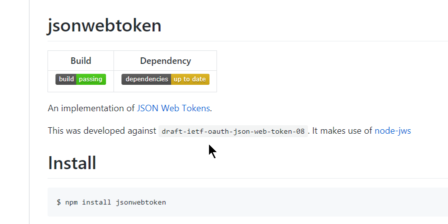
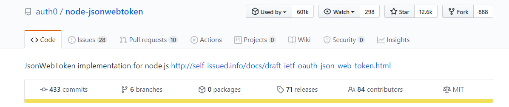
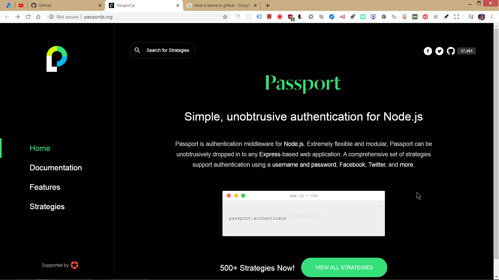

## **Jsonwebtoken**

This library is provided by auth0.

Also, you should look at **passport.js, coz this is also very popular** by its stars and but **it is used by 601k** and **jsonwebtoken is used by 601k**.(that's why jsonwebtoken is more trusted.)

you must look at passportjs

***

Use auth0.com to know more what it is...

## Access token, 

JONI CONVO..

OAuth 2.0, ==axios-oauth-client @ npm==

•oauth provider auth0 @googlesearch>?

•access token vs. refresh token?

•referesh tokens @googlesearch

•token should be sen with every request(joni) and backend shouldn't store it at all(joni)..

•(joni..)backend shouldn't store the refresh tokens..??

•If the application is for multiple users - the backend shouln't store he refresh tokens for security reasons but the refresh should be intiated from the browser.

***

### Amazing follow up after the course for tons of features of jwt

 • https://openbase.io/js/jsonwebtoken and  

 • Official documentation on the same page as the page @ https://www.npmjs.com/package/jsonwebtoken

Like - jwt.verify, and others.. 

***

###  why there's two such options when they do same thing ¿ They are different because they provide different  options check out for it, via searching the text expiresIn and notBefore via searching

***

#### jwt.verify

verification checking??

***

Whats more?..