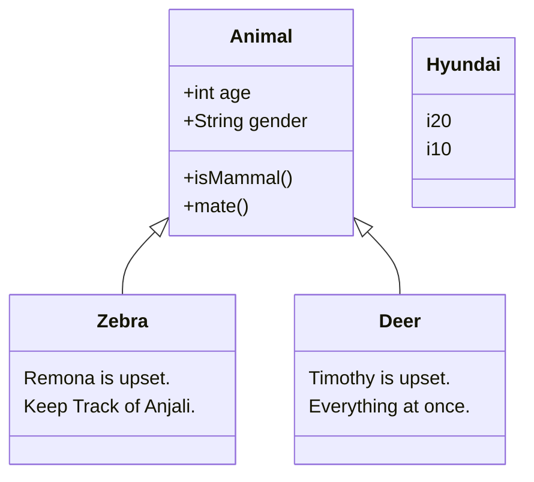
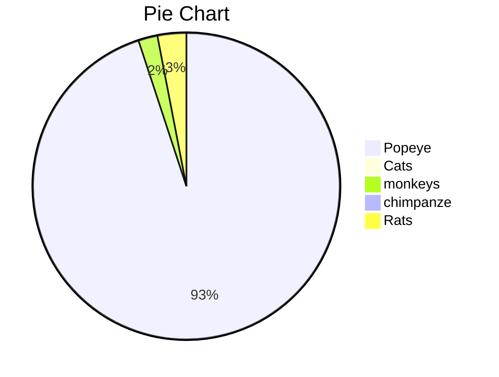
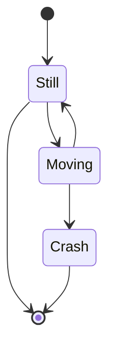
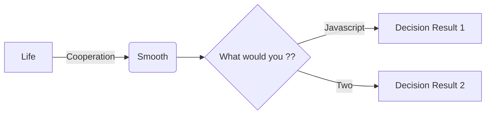

---

Rumours are worst to deal with.	This is YAML front matter. You may this to any document via context menu > insert > YAML front matter.
---

:happy:
:family_man_girl_boy:
:StartTypingSomeCharactedAutocompleteWillHelp

Video
You can use the <video> HTML tag to embed videos. For example:

<video src="xxx.mp4" />

<u>Underline</u> becomes Underline.

this text is red 

Strong
A double * or _ will cause its enclosed contents to be wrapped with an HTML <strong> tag, e.g:
**double asterisks**

__double underscores__

********
Internal Links:
Hold down Cmd (on Windows: Ctrl) and click on [this link](#ts-node for development <actually this is some heading in current typora md file>) to jump to header `Block Elements`. 

********
Horizontal Rules
Entering *** or --- on a blank line and pressing return will draw a horizontal line.

~~STRIKED TEXT~~

Use:

### Ctrl + shift + L : to close open the file tree

[^References : wikipedia]: This is a footnote
[^Footnotes: Abrakadabra]: Description1
[^Rain]: In amazons's forest

|      |      |      |
| ---- | ---- | ---- |
|      |      |      |
|      |      |      |
|      |      |      |

***

***

***

