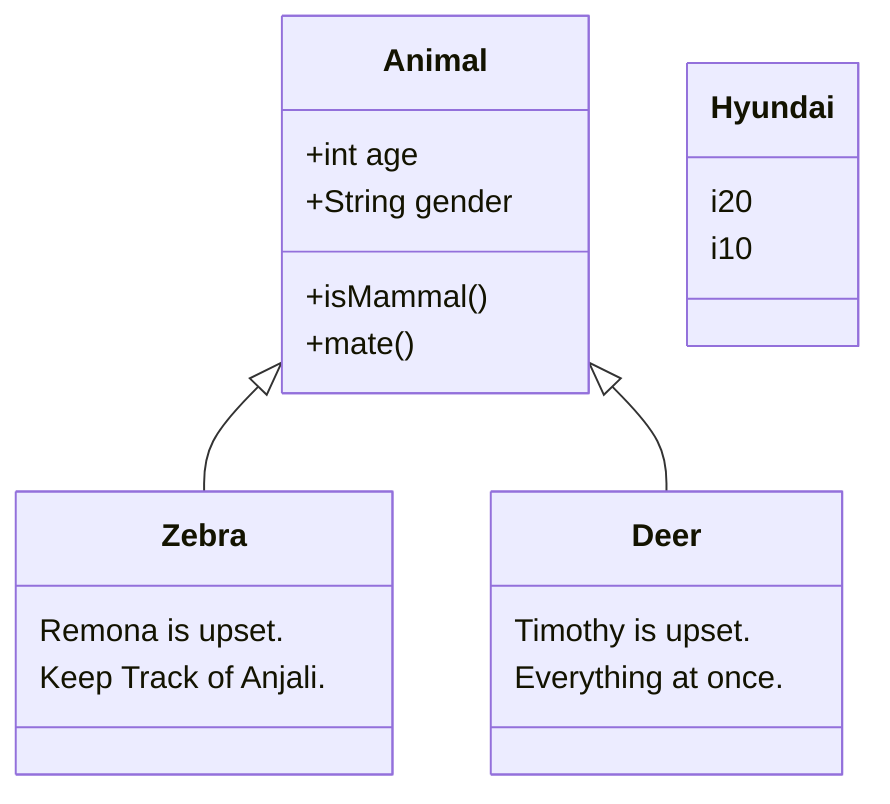
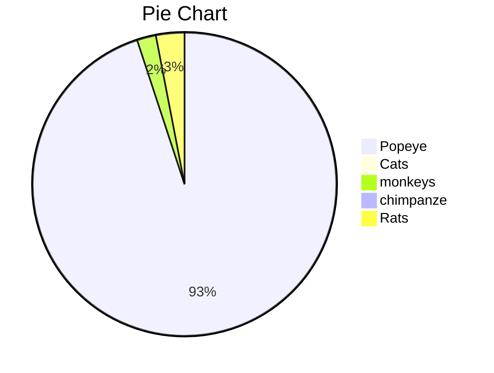
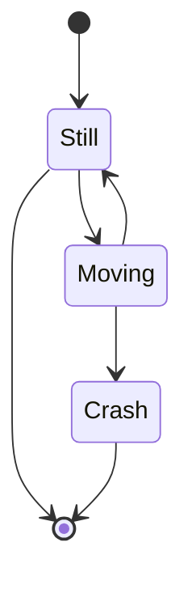
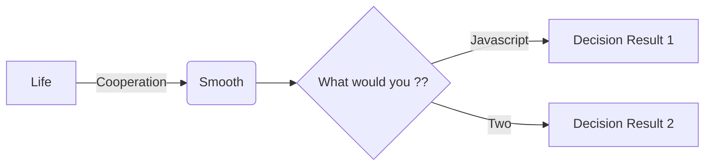

---

Rumours are worst to deal with.	This is YAML front matter. You may this to any document via context menu > insert > YAML front matter.
---

~~STRIKED TEXT~~

Use:

### Ctrl + shift + L : to close open the file tree

[^References : wikipedia]: This is a footnote
[^Footnotes: Abrakadabra]: Description1
[^Rain]: In amazons's forest

|      |      |      |
| ---- | ---- | ---- |
|      |      |      |
|      |      |      |
|      |      |      |

***

***

***

