Note: Never use : at the end of heading in typora, as it will cause problems while sharing links with people when shared in messaging groups as : at the end of the url is not regarded as the part of html link. Happy Hackings! :D​

## Vscode, Node, React, Mogoose

***

```js
({a:23}).a
// 23
({a: 23})['a'] // " double quotes would have worked the same way.
// 23
```

***

# Fastest way to create node project:-

```bash
$ npm init --yes
or
$ npm init -y
```

***

## Installing dependency as development dependency

```bash
$ npm i -D <dependency-name>
```

Also, -D is ==case sensitive==.

***

Link - [Beginner's Article, though good things.](https://nodesource.com/blog/an-absolute-beginners-guide-to-using-npm/)

• If you want to get on to building your project, and don't want to spend the (albeit brief) time answering the prompts that come from `npm init`, you can use the `--yes` flag on the `npm init` command to automatically populate all options with the default `npm init` values. 

 `npm init --yes` or ` npm init -y `

***

### For details of all the heroku repository:

```bash
$ heroku login
$ heroku info
# OUTPUT:
# === pacific-cliffs-97469
# Auto Cert Mgmt: false
# Dynos:          web: 1
# Git URL:        https://git.heroku.com/pacific-cliffs-97469.git
# Owner:          sahilrajput03@gmail.com
# Region:         us
# Repo Size:      302 KB
# Slug Size:      24 MB
# Stack:          heroku-18
# Web URL:        https://pacific-cliffs-97469.herokuapp.com/
_
$ heroku apps
# »   Warning: heroku update available from 7.33.3 to 7.41.1.
# === sahilrajput03@gmail.com Apps
# immense-tor-22661
# infinite-meadow-87397
# obscure-scrubland-72126
# pacific-cliffs-97469
# secret-beyond-42518
_
$ heroku whoami
#Output: sahilrajput03@gmail.com
_
$ heroku update
_
$ heroku help info #help text for info
_
$ heroku info immense-tor-22661
#=== immense-tor-22661
#Auto Cert Mgmt: false
#Dynos:
#Git URL:        https://git.heroku.com/immense-tor-22661.git
##Owner:          sahilrajput03@gmail.com
#Region:         us
#Repo Size:      0 B
#Slug Size:      0 B
#Stack:          heroku-18
#Web URL:        https://immense-tor-22661.herokuapp.com/
_
Adding heroku remote manually(only if you ran heroku create before createing git repository)
$ git remote add heroku https://git.heroku.com/immense-tor-22661.git
_
$ heroku help
_
$ heroku local web
_
$ heroku apps:destroy
#Deletes heroku app from website.
_

```

### CAnnot add custom domain without entering creditcard details. Shit.!

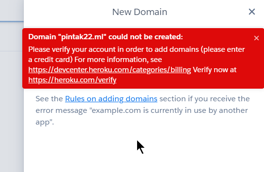


-

### Heroku - Failed to bind port?

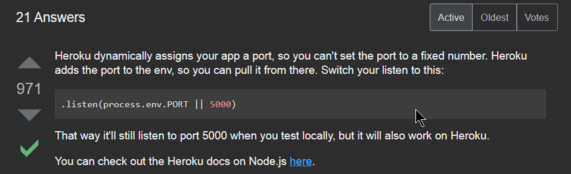

***

npm run eject: [What does this “react-scripts eject” command do?](https://stackoverflow.com/questions/48308936/what-does-this-react-scripts-eject-command-do)

***

Comment in node package.json file: add the comments as object:

```json
{
  "name": "napolux-frontend",
  "version": "1.0.0",
  "description": "it's a test",
  "main": "index.js",
  "scripts": {
    "test": "echo \"Error: no test specified\" && exit 1"
  },
  "author": "",
  "license": "MIT",
  "devDependencies": {
    "@babel/core": "^7.2.2",
    "@babel/preset-env": "^7.3.1",
    "babel-polyfill": "^6.26.0",
    "gulp": "^4.0.0",
    "gulp-babel": "^8.0.0",
    "gulp-rename": "^1.4.0",
    "gulp-uglify": "^3.0.1"
  },
  "dependencies": {
    "jquery": "^3.3.1"
  },
  "comments": {
    "dependencies": "we use jQuery because of reasons",
    "repository": "our beloved repo",
    "license": "we love MIT, so why not",
    "devDependencies": {
      "@babel/core": "it's @ version 7.2.2 because of...",
      "gulp-rename": "why not"
    }
  }
}
```

***

It might seem that the "npm start" in script is just unnecessary when when you have watch(which you use for nodemon index.js) but the truth is heroku or other server only runs the default npm start to start your application on the server. So you always keep statements from the package.json file and keep them in comments if you have some doubts about the usage. If you comment the "npm start" in the comment section and push to heroku, it just wont start the web application.

***

Alt + 232 => Gives Epsilon. That is last in alphabetical order.

```
α  alpha        U+03B1  Alt 224
Γ  gamma        U+0393  Alt 226
δ  delta        U+03B4  Alt 235
ε  epsilon      U+03B5  Alt 238
Θ  theta        U+0398  Alt 233
π  pi           U+03C0  Alt 227
Σ  sigma upper  U+03A3  Alt 228
σ  sigma lower  U+03C3  Alt 229
τ  tau          U+03C4  Alt 231
Φ  phi upper    U+03A6  Alt 232
φ  phi lower    U+03C6  Alt 237
Ω  omega        U+03A9  Alt 234
```

***

## Manage Big file awesomely

Open a file in two sections as separate but still one hardlink .. 

Try => Ctrl + \ will open the currently opened file in another window.

***

## **Region specific comments:**

//#region anyblahblah

/*

Everything here is commented ....

*/

//#end region anyblahblah

***

## Folding and unfolding of region specific comments 

• Ctrl+Shift+**[** , Ctrl+shift+**]**  to fold and unfold single **region specific comments**.
• Ctrl+**K+0** , Ctrl+**K+J** to to fold and unfold all the **region specific comments**.

***

Amazing link helped to solve: [@stackoverflow..](https://stackoverflow.com/questions/1921628/how-to-implement-regions-code-collapse-in-javascript)

***

Ctrl + R =>> Open recent projects in vscode.;

Ctrl + (KO) to open a folder.

***

```js
//#region Baap Jyada

console.log("hello");
/* 
* With help of Better Comments
! Important thing 
TODO: You may follow  
? Important Love
* You May follow things like this. 
console.log("message");
console.log("message");  */

//#endregion
```

***

When executables are installed via npm packages, npm creates links to them:

- **local** installs have links created at the `./node_modules/.bin/` directory

- **global** installs have links created from the global `bin/` directory (for example: `/usr/local/bin` on Linux or at `%AppData%/npm` on Windows)[#npm global #global path npm , npm ]

  ```bash
  $ npm config get prefix
  ```

  

- Windows: C:\Users\chetan\AppData\Roaming\npm OR %AppData%/npm

***

 facet :  one side of something many-sided, especially of a cut gem. ;  a particular aspect or feature of something. 

***

About npm modules: some modules(**eslint,express,nodemon,react-scripts**) install globally with the executables in the home folder i.e. C:\Users\chetan\AppData\Roaming\npm , but other modules do install  but not with the executables in the folder C:\Users\chetan\AppData\Roaming\npm. So its not odd for different modules to have executables and some don't.

***

[Freecodecamp - npm vs npx](https://www.freecodecamp.org/news/npm-vs-npx-whats-the-difference/)


***

### Using environment variables in windows:

set : will print all the environment variables

set SAHIL=SOMETHING-ANYTHING

set SAHIL : will print the value of system variable in cmd.

```bash
C:\Users\chetan>set cdd=cd ..

C:\Users\chetan>%cdd%		# Also you can get value as: echo %cdd%

C:\Users>
```

 https://www.poftut.com/how-to-list-set-get-windows-environment-variables-with-set-command-in-command-line-ms-dos/ 

***

### Using environment variables in windows:

```bash
`printenv`
```

***

# Sending response back to the request in express:

```bash
# common responses

response.status(400).send("username already exists.")


response.status(400).end() // use this line instead of the above to # NOT RETURN ANYTHING.


response.status(201).send("abrakadabra"); //CONTENT-TYPE:TEXT/HTML, STATUS-CODE:201


response.status(200).json("abrakadabra"); //CONTENT-TYPE:APPLICATION/JSON, STATUS-CODE:200


response.send("abrakadabra"); // CONTENT-TYPE:TEXT/HTML, STATUS-CODE:200


response.json(notes.map((note) => note.toJSON())); // basically converts the array of objects to array of json. JSON is text, and we can convert any JavaScript object into JSON, and send and receive JSON to the server.
***

# Check in db if some property already exists..
const person = await User.find({ username: body.username }); // # finds in DB
    if (person) {
      response.status(400).send("username already exists.")
//    response.status(400).end() // use this line instead of the above to # NOT RETURN ANYTHING.
//    response.end() // use this line instead if you want # DEFAULT STATUS CODE i.e., 200 OK.
    }
***

# Do it in another form:(use chaining benefit.)
const person = await User.find({ username: body.username }).then(person => {
if(person){
// response here....
}
})


# HOW THEN CHAINING WORKS

request.then((response) => response.data).then((d)=>console.log(d))

			^^^^^^^^^^^^^^^^^^^^^^^^^^^^ this is done so as to get it in the next then function as 											the direct variable as d.

***

CHEATTT:
response.send(blogs) // THE ABOVE RESPONSE.JSON(BLAH BLAH BLAH.. ) AND THIS LINE WORKS SAME. Doubt test it. So this means you cans end the js objects as it is. And they appear same as in the browser as well.


***
# Common status code classes:

1xxs – # Informational responses: The server is thinking through the request.
2xxs – # SUCCESS! The request was successfully completed and the server gave the browser the expected response.
3xxs – # Redirection: You got redirected somewhere else. The request was received, but there’s a redirect of some kind.
4xxs – ## Client errors: Page not found. The site or page couldn’t be reached. (The request was made, but the page isn’t valid — this is an error on the website’s side of the conversation and often appears when a page doesn’t exist on the site.)
5xxs – ## Server errors: Failure. A valid request was made by the client but the server failed to complete the request.
***


# HTTP COMMON USECASES AND STATUS CODES: (for CRUD OPERATIONS too..)
200: series-
200 OK
201 Created
202 Accepted
203 Non-Authoritative Information
204 No Content
205 Reset Content
206 Partial Content
207 Multi Status
208 Already Reported
209 unknown
210 unknown

400: series-
400 Bad Request
401 Unauthorised
402 Payment Required
403 Forbidden
404 Not Found
405 Method Not Allowed
406 Not Acceptable
407 Proxy Authentication Required
408 Request Timeout
409 Conflict
410 Gone
411 Length Required
412 Precondition Failed
413 Payload Too Large
414 URI Too Long
415 Unsupported Media Type
416 Range Not Satisfiable
417 Expectation Failed
418 I'm a Teapot
419 unknown
420 unknown
etc....

500: series-
500 Internal Server Error
501 Not Implemented
502 Bad Gateway
503 Service Unavailable
504 Gateway Timeout
505 HTTP Version Not Supported
506 Variant Also Negotiates
507 Insufficient Storage
508 Loop Detected
509 Bandwidth Limit Exceeded
510 Not Extended
511 Network Authentication Required
512 unknown
513 unknown

#Other Status Code, Some Default Error codes from libraries:
*ERROR STATUS CODE FROM MOONGOOSE:
500 Internal Server Error
ValidationError ,User validation failed: username: Path `username` (`d`) is shorter than the minimum allowed length (3)
***

# Front end, checking the status of the promise like this -
request.then((response) => console.log("response.status :", response.status));
request.then((response) => alert("response.status :"+ response.status));
***

# Although,   request.then((response) => alert("response.status :", response.status)); // doesn't work LOL bcoz using ',' is only supported in console.log(a,b,c,d,e,etc)

Short notes: 	
• console.log()	>> , and + works
• alert() 	   	>> + 	'( , dont work)'
• confirm()		>> + 	'( , dont work)'
• prompt()		>> +	'( , dont work)' , also if nothing is send in prompt, it will return null.
***


```

Blog post link - [Link](https://moz.com/learn/seo/http-status-codes)

***

# _id and __v while creating objects in mongodb.

_id : unique id

__v : mongo versioning field  

***

# Close all opened opened files:

Ctrl+K , W 	in vscode.

***

```js
const array1 = ['a', 'b', 'c'];

array1.forEach(element => console.log(element));

// expected output: "a"
// expected output: "b"
// expected output: "c"

```

***

# To test `undefined` variable or property:

 Use the `typeof` operator, like this: `if(typeof myVar === 'undefined')`. 

It was error, 

```js
const isNullOrUndefined = val => val === undefined || val === null;
console.log(isNullOrUndefined(null));        // true
console.log(isNullOrUndefined(undefined));   // true
console.log(isNullOrUndefined('Batman'));    // false
```


***

# While testing:

You must not be running your server, other wise it will give you error 

```bash
: Timeout - Async callback was not invoked within the 5000ms timeout specified by jest.setTimeout.Timeout - Async callback was not invoked within the 5000ms timeout specified by jest.setTimeout.Error:
```

***

# undefined:

You should never return undefined like:

```js
return undefined
//because it will break the program from an unknown point, and you might never be able to figure out where has the program brocken state has originated from.
SO IF YOU MUST RETURN IT.. use..
return notdefinedvariable
//so this will actually return something you actually looking for.
BUT THIS IS WRONG TOO..
YOU SHOULD NEVER EVER TRY TO RETURN UNDEFINED, IF ITS RETURNING FOR TESTING PURPOSE, ITS GOOD OTHERWISE ITS BAD, BCOZ IT WOULD OTHER ENDS TOO.
>>> NEVER EVER RETURN UNDEFINED <<<<
    
```

***

# What if a function doesn't return nothing(undefined)

It returns undefined.

For e.g., 

```
let kk = () => console.log("buda")
let kkreturn = kk()
console.log(kkreturn)
//outputs: undefined
```

```js
let say:
let kk =() =>{
clg SAHIL
clg MOHIT
return 1
//the function will not reach ..
}

***
let kk =() =>{
clg SAHIL
clg MOHIT
return undefinedVariable
//the function will go on even further....
clg MUMBAI KE HERO.(this will pe printed..)
}
```

***

# Saving a document in mongodb with no id:

```js
{
    _id: null,
    title: "Title-1 is whatever or, every thing in this line is title.",
    author: "Ramanujan",
    url: "https://www.ramanujan.com",
    likes: 499,
    __v: 0
  },
```

If you try to save  this document, then the resultant document saved in the db will have the _id as its property along with the _id value generated by the mongodb.

***

##### All the keybindings have to be removed to map for a command, if the desired shortcut binding is already assigned to many commands.

***

# Now toggle in terminals

Press Alt+Right to move to the right terminal.

Press Alt+Leftto move to the left terminal.

***

# Update only the field which are given in the request by the post request:


***

# Uninstalling npm module:

```bash
npm uninstall bcrypt --save
```

***

# Moongoogse warnings

```js
const mongoose = require('mongoose')
mongoose.set('useNewUrlParser', true);
mongoose.set('useFindAndModify', false);
mongoose.set('useCreateIndex', true);
```

***

# Importing Exporting in node.js(CommonJS Style)

```js
// testModule.js - DIRECT VARIABLE
module.exports = "This is a test!"

// index.js
const test = require('./testModule.js')
console.log(test) // => "This is a test!"
```

```js
// helpers.js - DIRECT FUNCTION
module.exports = function(x) {
  return x * 2
}
// index.js
const helpers = require('./helpers.js')
helpers(4) // => 8
```

```js
// helpers.js - OBJECT OBJECT
module.exports = {
  multiplyByTwo: function(x) { return x *2 },
  divideByTwo: function(x) { return x / 2}
}
// index.js 
const anyobjectName = require('./helpers.js')
anyobjectName.multiplyByTwo(10) // => 5

// or, you can import just the named property you need - NAMED IMPORT
const divideByTwoRenamed = require('./helpers.js').divideByTwo // if_u_require_to_rename_properties_imported_you_Need_to_do_like_that.
divideByTwoRenamed(18) // => 9
```

```js
// helpers.js - CASE INTERESTING.
module.exports.multiplyByTwo = function(x) { return x * 2 }
module.exports.divideByTwo = function(x) { return x / 2 }
function nonExportedFunction(x) {
  return x * 3
}
// index.js
const helpers = require('./helpers.js/)
const divideByTwoRenamed = require('./helpers.js').divideByTwo // if_u_require_to_rename_properties_imported_you_Need_to_do_like_that.
```

```js
// helpers.js
module.exports.multiplyByTwo = function(x) { return x * 2 }
module.exports.divideByTwo = function(x) { return x / 2 }
module.exports = "I just overwrote all my exports! Don't mix these styles!"
```

Curyying is also made to link with export and imports. Check @ [Link on medium](https://medium.com/@osiolabs/use-module-exports-to-keep-node-js-code-organized-9379526ebac8) .

***


# Coding Conventions:

Classes	Class names should be nouns in UpperCamelCase, with the first letter of every word capitalised. Use whole words — avoid acronyms and abbreviations (unless the abbreviation is much more widely used than the long form, such as URL or HTML).

Methods	Methods should be verbs in lowerCamelCase or a multi-word name that begins with a verb in lowercase; that is, with the first letter lowercase and the first letters of subsequent words in uppercase.

Variables	Local variables, instance variables, and class variables are also written in lowerCamelCase. Variable names should not start with underscore (_) or dollar sign ($) characters, even though both are allowed. This is in contrast to other coding conventions that state that underscores should be used to prefix all instance variables.
Variable names should be short yet meaningful. The choice of a variable name should be mnemonic — that is, designed to indicate to the casual observer the intent of its use. One-character variable names should be avoided except for temporary "throwaway" variables. Common names for temporary variables are i, j, k, m, and n for integers; c, d, and e for characters.

Constants	Constants should be written in uppercase characters separated by underscores. Constant names may also contain digits if appropriate, but not as the first character.

***

###  The built-in JavaScript libraries use the same naming conventions as Java. 

***

While on the nodemon you can restart easily, i.e., when the server has brocken , you may type **rs** and press **Enter** key to restart the server.

And also debugging you can always set marker i.e., tyep something like 

```bash
****hererby brocken already****
and press Enter key to let it print to the console.
```

***

```bash
nodemon server.js
nodemon server.js 3006
```

***

```js
# Convert object to json string:
JSON.stringify(s) // where s is object.
```


***

The **try** statement allows you to define a block of code to be tested for errors while it is being executed.

The **catch** statement allows you to define a block of code to be executed, if an error occurs in the **try** block.

The **finally** statement lets you execute code, after try and catch, regardless of the result.

***

## Callback

`done` is a callback that you need to call once you are done with your work. As you can see it is given in the first line of your code:

```js
function(req, email, password, done){
```

This means that besides the incoming request you get the user-specified `email` and `password`. Now you need to do whatever you need to do to verify the login. Somehow you need to tell Passport whether you succeeded or not.

Normally, you may use a return value for this, but in this case the Passport author thought about the option that your check may be asynchronous, hence using a return value would not work.

This is why a callback is being used. Most often callbacks are being called `callback`, but this is just for convenience, there is no technical reason to do so. In this case, since the callback is being used for showing that you are *done*, the Passport author suggested to call it `done`.

Now you can either call `done` with an error if credential validation failed, or with the appropriate parameters to show that it succeeded.

This works because functions are so-called *first-class citizens* in JavaScript, i.e. there is no actual difference between code and data: In JavaScript you can pass functions around as parameters and return values as you can with data.

And that's it :-)

***

## Callback function

A callback function is a function passed into another function as an argument, which is then invoked inside the outer function to complete some kind of routine or action.

Here is a quick example:

```js
function greeting(name) {
  alert('Hello ' + name);
}

function processUserInput(callback) {
  var name = prompt('Please enter your name.');
  callback(name);
}

processUserInput(greeting);
```

The above example is a [synchronous](https://developer.mozilla.org/en-US/docs/Glossary/synchronous) callback, as it is executed immediately.

Note, however, that callbacks are often used to continue code execution after an [asynchronous](https://developer.mozilla.org/en-US/docs/Glossary/asynchronous) operation has completed — these are called asynchronous callbacks. A good example is the callback functions executed inside a `.then()` block chained onto the end of a promise after that promise fulfills or rejects. This structure is used in many modern web APIs, such as `fetch()`.

***

```js
const requestLogger = (request, response, next) => {
  console.log('Method:', request.method)
  console.log('Path:  ', request.path)
  console.log('Body:  ', request.body)
  console.log('---')
  next()
}
```

above next() function only works when you specify if in the parameters area as next.

***

ou can have a different theme per workspace/folder by adjusting the `workbench.colorTheme` in the workspace settings.

1. Open a new VSCode window.
2. Open the project folder where you would like to have a different color theme.
3. Navigate to File > Preferences > Settings.
4. Select the "Workspace Settings" tab at the top of the settings screen. Anything you edit in here will now be specific to this workspace.
5. Search for "colorTheme" and select the color theme you would like for this specific workspace.

[](https://i.stack.imgur.com/gigb5.png)

Now, whenever you reopen that folder, the color theme will match what you set in the workspace settings.

***

[[Open files always in a new tab](https://stackoverflow.com/questions/38713405/open-files-always-in-a-new-tab) - LOL](https://stackoverflow.com/questions/38713405/open-files-always-in-a-new-tab)

```JS
LONG STORY SHORT:
Search for 'Preview' in SETTINGS, and DISABLE >> 
# Workbench>Editor:Enable Preview,
also DISBALE >> 
# Workbench>Editor: Enable Preview From Quick Open.

**********************************************************
When you [single-]click a file in the left sidebar's file browser or open it from the quick open menu (Ctrl-P, type the file name, Enter), Visual Studio Code opens it in what's called "Preview Mode", which allows you to quickly view files.

Preview Mode tabs are not kept open. As soon as you go to open another file from the sidebar, the existing Preview Mode tab (if one exists) is used. You can determine if a tab is in Preview Mode, by looking at its title in the tab bar. If the title is italic, the tab is in preview mode.

To open a file for editing (i.e. don't open in Preview Mode), double-click on the file in the sidebar, or single-click it in the sidebar then double click the title of its Preview Mode tab.

If you want to disable Preview Mode all together, you can do so by setting "workbench.editor.enablePreview": false in your settings file. You can also use the "workbench.editor.enablePreviewFromQuickOpen" option to disable it only from the quick open menu.

Before you can disable Preview Mode, you'll need to open your Settings File.

Pro Tip: You can use the Command Palette to open your settings file, just enter "Preferences: Open User Settings"!

Once you've opened your settings file (your settings file should be located on the right), add the "workbench.editor.enablePreview" property, and set its value to false.

You can learn more about Visual Studio Code's "Preview Mode", here.
```

***

Currying/Double arrow functions:

```js
const ui = ()=>(something)=>console.log("I am a "+something)
ui()("Programmer")
//OUTPUT: I am a Programmer.
```

***

## A factory function is any function that returns an object.

**Classes and constructor functions** require the `new` keyword to instantiate objects while **factory functions** return the instantiated object itself.

***

# Factory Functions

A factory function is any function that returns an object. Yup, that's pretty much it. This is not to be confused with classes and [constructor functions](https://www.w3schools.com/js/js_object_constructors.asp). **Classes and constructor functions** require the `new` keyword to instantiate objects while **factory functions** return the instantiated object itself.

```
function factory(name) {
  return { name };
}

const obj = factory('Some Dood');
console.log(obj.name); // 'Some Dood'
```

# Using Closures for Private Variables

We now have all the knowledge needed to emulate "private" variables in JavaScript. We can begin by writing a factory function that returns an object with getter and setter methods. The factory function takes in two arguments that correspond to the "private" properties of the returned object.

```
function createAnimal(name, job) {
  // "Private" variables here
  let _name = name;
  let _job = job;

  // Public variables here
  return {
    // Getter Methods
    getName() {
      return _name;
    },
    getJob() {
      return _job;
    },
    // Setter Methods
    setName(newName) {
      _name = newName;
    },
    setJob(newJob) {
      _job = newJob;
    }
  };
}
```

We can then invoke the factory function to create new instances of an animal object. Note that every time we invoke the factory function, a new closure is created. Therefore, each returned object has access to its own closure.

```
const presto = createAnimal('Presto', 'Digger');
const fluffykins = createAnimal('Fluffykins', 'Jumper');
```

So what have we achieved by doing this? Well, with the power of closures, we have essentially emulated "private" variables in JavaScript.

```js
// These properties will be inaccessible
console.log(presto._name); // undefined
console.log(presto._job); // undefined
console.log(fluffykins._name); // undefined
console.log(fluffykins._job); // undefined

// Getter methods have access to the closure
console.log(presto.getName()); // 'Presto'
console.log(presto.getJob()); // 'Digger'
console.log(fluffykins.getName()); // 'Fluffykins'
console.log(fluffykins.getJob()); // 'Jumper'

// Setter methods can mutate the variables in the closure
presto.setName('Quick');
presto.setJob('Bone Finder');
fluffykins.setName('Mittens');
fluffykins.setJob('Fish Eater');

console.log(presto.getName()); // 'Quick'
console.log(presto.getJob()); // 'Bone Finder'
console.log(fluffykins.getName()); // 'Mittens'
console.log(fluffykins.getJob()); // 'Fish Eater'
```

***

# A Strange Concoction of Programming Paradigms

This workaround is indeed a strange way to achieve a seemingly simple feature of object-oriented languages. But if one were to analyze this very closely, there is beauty in this workaround. For one, it cohesively glues together two different and rather conflicting programming paradigms: [object-oriented](https://en.wikipedia.org/wiki/Object-oriented_programming) and [functional](https://en.wikipedia.org/wiki/Functional_programming) programming.

The object-oriented nature of this approach involves the use of factory functions, mutability, and encapsulation. On the other hand, the functional approach involves the use of closures. JavaScript truly is a multi-paradigm language that continues to blur the borders between the contrasting paradigms.

One could argue that gluing the two paradigms together is messy and peculiar. In my opinion, I wouldn't say that that's *entirely* correct. Even if the amalgamation of paradigms does not follow conventions and design patterns, I find it greatly fascinating that to implement an object-oriented feature in JavaScript, one must use the features of functional programming. The two contradicting paradigms work together in harmony, similar to that of the [yin and yang](https://en.wikipedia.org/wiki/Yin_and_yang). Despite their differences, there is always a way to make things work. Perhaps this could be an analogy for life?

Link to blogpost: [@dev.to](https://dev.to/somedood/emulating-private-variables-in-javascript-with-closures-and-factory-functions-2314)

***

## Instance variable: 

In object-oriented programming with classes, an **instance variable** is a **variable** defined in a class (i.e. a member **variable**), for which each instantiated object of the class has a separate copy, or **instance**. An **instance variable** is similar to a class **variable**.

***

# Local Storage

```js
localStorage.setItem("lastname", "Smith");
localStorage.setItem("key", "value");
localStorage.getItem("lastname");
localStorage.removeItem("key");
```

***

# Delete a line

### Ctrl+shift+k

NOTE: Ctrl + X will cut and paste it to the clipboard.

***

# Select a block in vscode

Alt + Shift + Right/Left

Remember: Alt + Shift + Up/ Down => will cause the line/s to to duplicate as you do in the direction with arrow.

***

# Move a window to right Column:

Ctrl+Alt+Right Arrow

***

# Switch Active window in multiple windows

Ctrl+1, Ctrl+2, Ctrl+3

***

# Cancel tab switching

While holding Ctrl+tab, press `

***

```
A political map is a map that shows the political boundaries of that particular area. ... Political maps are designed to show governmental boundaries of countries, states, and counties, the location of major cities, and they usually include significant bodies of water.
```

***

# `

### Backtick, Grave Accent Character  - Used in Template literal in Javascript

Accent acute and, like the other one, changes the pronunciation of the vowel.

**left quote**, **open quote**, **back quote**,**backquote** is a punctuation mark

***

You can fastly convert an promise.then chain to an async function, by right-clicking it and and clicking "quick fix"


and it would be like:


***

### Snipping Tools sucks

You can always keep snipping tool minimized and let it capture easily with hotkey - ctrl+printscreen. and when its done click new and press esc.

***

# axio.delete

```
So after a number of tries, I found it working.

Please follow the order sequence it's very important else it won't work

axios.delete(URL, {
  headers: {
    Authorization: authorizationToken
  },
  data: {
    source: source
  }
});
```

***

# axios.put

```js
const increaseVoteAxios = async (content, id, votes) => {
  let currentAnecUrlWithId = `${baseUrl}/${id}`;
  const object = { content, votes: votes + 1 };
  try {
    const response = await axios.put(currentAnecUrlWithId, object);
    console.log("response.status:", response.status);
    return response.data;
  } catch (error) {
    console.log(
      "☻☻☻-004 ASYNC FUNCTION FAILED IN ./src/services/anecdoteAxios.js"
    );
    return null;
  }
};
```


***


# For testing in single file via nodemon

```js
const axios = require("axios"); // and not the es6 import axios from 'axios'
```

***

# Axio Helpl

https://kapeli.com/cheat_sheets/Axios.docset/Contents/Resources/Documents/index

^^^ cheatsheet

***

# Axios single file testing

via **nodemon**

You may use axios for static(absolute domain:port in the baseUrl [*const baseUrl2 = 'http://localhost:3003/api/login'*], that'll work too, but you would have to make changes everywhere then. And thats not affordable.)

`nodemon <Axios_commands_file.js>`

```js
// import axios from "axios"
const axios = require("axios");
const baseUrl = "/api/blogs";
const instance = axios.create({
  baseURL: baseUrl,
  proxy: {
    host: "localhost",
    port: 3003,
  },
});

const deleteWithId = (id) => {
  console.log("Deletion executed..");
  const request = instance.delete(`/${id}`);
  return request.then((response) => response.data);
};

const getAll = () => {
  const request = instance.get('/');
  return request.then((response) => console.log(response.data));
};

// getAll()

// deleteWithId('5e88e91c7573ee2664ad2a39');
```

help @ [axios cheatsheet](https://kapeli.com/cheat_sheets/Axios.docset/Contents/Resources/Documents/index)

***

# Or you may directly configure config inline in axios

```js

const deleteWithId = (id) => {
  console.log("Deletion executed..");
  const request = axios.delete(`${baseUrl}/${id}`, {
    proxy: {
      host: "localhost",
      port: 3003,
    },
  });
  return request.then((response) => response.data);
};  
    
    or
    
const deleteWithId = (id) => {
  console.log("Deletion executed..");
  // const request = instance.delete(`/${id}`);
  const request = axios.delete(`/${id}`, {
    baseURL: baseUrl,
    proxy: {
      host: "localhost",
      port: 3003,
    },
  });
  return request.then((response) => response.data);
};
```

***


```js
# Getting expert with promise:-
//everything returned from a .then method is a promise.

 //to fetch the array of data from it, you need to assign from inside it

 // like .then(t=>variable=t) and variable will be assigned the data from the promise.
***
//IF YOU WANT TO CONSOLE LOG THE DATA FROM THE PROMISE RESPONSE, DO IT LIKE THIS.
request.then((response) => console.log("response.data :", response.data));// data returned
request.then((response) => console.log("response.status :", response.status)); //status code returned
return request.then((response) => response.data);
// YOU NEED TO CONSOLE LOG BEFORE RETURNING ONLY.
```


***

# Epic nature of react:

So, its been great to see what react can do, and how it does. First of all, the useState hook, this hook is great not just as it automatically creates the setter function for the given variable. e.g., 

```js
const [notes,setNotes] = useState('InitialNotesArrayState')
```

here setNotes is function that sets the notes array whenever we like it to do that. This is not as much interesting as we used to think of if earlier, as its just a  function, BUT its hell of much interesting in nature as the siginificant role of the hook lies when the notes array state is changed with the setNotes function; it renders ALL THE COMPONENTS which are related to notes state array.

Next, useEffect() is interesting hook as it renders the all the componets under the the tag in which you are working in the index.html. This might seem to be complicated to hear. But it is not, it is just meant to say that react only works on the element it has been griped to render in the index.html with the help of ReactDOM.render() function.

```js
ReactDOM.render(
  <App />,
  document.getElementById('root')
)
```

That's just not even the beginning of the useEffect() hook. As its sole purpose is to update the components in the DOM from the virtual DOM via detecting the defined changes. It's just that we can define when to update the DOM. So what are these defined chages, so these are to be defined in a weird way. This is weird because you can use this hook to SUPER ACTIVE MODE, so what's that now. Lets look with example.

```js
useEffect(() => {
    const loggedUserJSON = window.localStorage.getItem("loggedBlogappUser");
    if (loggedUserJSON) {
      const user = JSON.parse(loggedUserJSON);
      setUser(user);
      blogService.setToken(user.token);
      setreadyToFetch(true);
    }
  }, []);
```

so the above code ony update the DOM at the time of page load(first load). So that just means you may define some code operations when the rendering has been done to the page. And this isn't helpful to loading some content from the server but to do other specific operation which are peculiar. Like what I'm doing here is fetching the saved user from the localStorage from the browser. Although, other asynchronous operation like loading the blogs are already done before the hook started as useEffect hook only executes when the page has completed rendering. The point of explaining this is to explain about the ciritical parameter(2nd parameter i.e., []) if we wish to do so. This parameter tells the hook to only execute once. But what if we defined something inside the array, or we just don't specify the array like ommitting the array. What happens in these two cases? So in the former case if we define some hook states inside the array like-

```js
useEffect(() => {
    user &&
      readyToFetch &&
      blogService
        .getAll()
        .then((initialNotes) =>
          setBlogs(initialNotes.sort((a, b) => b.likes - a.likes))
        ) &&
      setreadyToFetch(false);
    // console.log("useeffect executed..");
  }, [user, readyToFetch]);
```

So, here in this example I've initialized it with two arguments i.e., user and readyToFetch hook states. This is to make the hook execute only if these state hook states change, not in any other circumstance. You can check these saying by making some changes to these somewhere in the code and putting a `console.log(' hook executed')` in the useEffect hook. 

What about the latter case, i.e., omitting the array from the useEffect hook. This is actually interestingIt does that. It executes with every hook state change in the code. So, like 

```js
useEffect(()=>{
    console.log('Yama Yama, hu haa hu haa!!')
    console.log('Yo YO, Puku PUku!!')
  })
```

It looks for all the other hooks like useState, useEffect, etc and when the execute it executes too. 
Also, you can call/use any other hook inside this hook. Like setNote(notesNew), setUser(loggedInUserFromLocalStorage),

Happy coding!! So hooks are real.

***

# Code Folding: 

```ini
To fold all: Ctrl+K Ctrl+ 0
To unfold all: Ctrl+K Ctrl+J

To fold at current cursor: Ctrl+Shift+[
To unfold at current cursor: Ctrl+Shift+]

First members: Ctrl + K Ctrl+1
Second members: Ctrl + K Ctrl+2
Third members: Ctrl + K Ctrl+3
Fourth members: Ctrl + K Ctrl+4
Fifth members: Ctrl + K Ctrl+5
```


***

# Emmet Cheatsheet: https://docs.emmet.io/cheat-sheet/

****

# Adding type checking


*


***

To just select the file without opening or closing or collapsing or expanding, hold the ctrl key and select the file/folder in the left side Explorer.

***

Jump to next error: F8

***

defer: put off (an action or event) to a later time; postpone.

***

## Simple Destructing to get a property of the object:

```js
let obj = {name:"sahil",lastname:"rajput"}
let {name} = obj
let {lastname} = obj
//name and lastname are "sahil" and "rajput" respectively.
```

***

### What the heck is eventloop anyway -video on youtube fron jsconf

```js
console.log('hi')
setTimeout(()=> console.log('there'),0)
console.log('JSConfEU')
console.log('JSConfEU')
console.log('JSConfEU')
console.log('JSConfEU')
console.log('JSConfEU')
console.log('JSConfEU')
console.log('JSConfEU')
console.log('JSConfEU')
console.log('JSConfEU')
console.log('JSConfEU')
console.log('JSConfEU')
console.log('JSConfEU')
console.log('JSConfEU')
console.log('JSConfEU')
console.log('JSConfEU')
console.log('JSConfEU')
//output below...
VM322:1 hi
VM322:3 JSConfEU
VM322:4 JSConfEU
VM322:5 JSConfEU
VM322:6 JSConfEU
VM322:7 JSConfEU
VM322:8 JSConfEU
VM322:9 JSConfEU
VM322:10 JSConfEU
VM322:11 JSConfEU
VM322:12 JSConfEU
VM322:13 JSConfEU
VM322:14 JSConfEU
VM322:15 JSConfEU
VM322:16 JSConfEU
VM322:17 JSConfEU
VM322:18 JSConfEU
VM322:2 there
```

### The event loops job is to look at the stack and look at the task queue. If the stack is empty(the currently running code), it takes the first thing on the queue and pushes it on to the stack, which effectively runs it. That all what happens when we come across an async call.

Chrome v8 engine has multiple api with c++, but what we are allowed to work with is the Javascript Runtime Environment. So JS Runtime Environment is single threaded and executes its tasks with help of a stack like.

main()... then next command .... then next command.....and so on...

```js
console.log('hi')
setTimeout(()=> console.log('there1'),0)
console.log('JSConfEU')
console.log('JSConfEU')
console.log('JSConfEU')
console.log('JSConfEU')
console.log('JSConfEU')
console.log('JSConfEU')
setTimeout(()=> console.log('there2'),0)
console.log('JSConfEU')
console.log('JSConfEU')
console.log('JSConfEU')
console.log('JSConfEU')
console.log('JSConfEU')
setTimeout(()=> console.log('there3'),0)
console.log('JSConfEU')
console.log('JSConfEU')
console.log('JSConfEU')
console.log('JSConfEU')
console.log('JSConfEU')

//output below
hi
VM341:3 JSConfEU
VM341:4 JSConfEU
VM341:5 JSConfEU
VM341:6 JSConfEU
VM341:7 JSConfEU
VM341:8 JSConfEU
VM341:10 JSConfEU
VM341:11 JSConfEU
VM341:12 JSConfEU
VM341:13 JSConfEU
VM341:14 JSConfEU
VM341:16 JSConfEU
VM341:17 JSConfEU
VM341:18 JSConfEU
VM341:19 JSConfEU
VM341:20 JSConfEU
undefined
VM341:2 there1
VM341:9 there2
VM341:15 there3
```

***

### Callbacks can be one of two things:

Callback can be any fuction that calls another function OR callbacks can be more explicitly an asynchronous callback as in one that will get pushed back on the callback queue in the future.

```js
[2,3,5,6,6].forEack((t)=>console.log(t))
```

In the above example, forEach is an callback but it is not running asynchronously, it's running it within the current stack.

***

## **Array.reduce**

```js
const arr = [2,3,4,5]
let reducedValue = arr.reduce((acc,cur)=>acc+cur ,10)	//here 10 is an optional parameter, if omitted it would be considere 0.
//output: reducedValue is 24, as 10+2+3+4+5=24

const arr = [2,3,4,5]
arr.pop()
console.log(arr)
//output: [2,3,4]

const arr = [2,3]
let reducedValue = arr.reduce((acc,cur)=>acc*cur ,10)
//output: reducedValue is 60, as 10*2*30

const noteArray = [{},{},{}]
let reducedValue = popo.reduce((acc,cur)=>acc+cur.likes,0)
```

***

# **How promises work:**

```js
// # Simplest Promise Ever E.g.1:

let what = true;// true will resolve with 687, false will reject with 786
let pa = new Promise((resolve, reject) =>
  setTimeout(() => (what ? resolve(687) : reject(786)), 3_000)
);
pa.then((j) => console.log("The value of j is ", j)).catch((r) =>
  console.log("The value of r is ", r)
);
//* see the redundant catch method in e.g.3
```

```js
// # Simplest Promise Ever E.g.2:

// Syntax fetch api, it is an asynchronous task
//it creats promise and we know we can receive vale from promises
// with the help of .then method, so :-
fetch("ANY-URL-HERE");

//Visit to google.com and execute this, and do another time go to yahoo.com and execute the same,
// see what is the difference:
fetch("https://www.google.com")
  .then((val) =>
    console.log(
      "Promise is RESOLVED, and we have received",
      val,
      ",with status value",
      val.status,
      "+ Asynchronous task resolved."
    )
  )
  .catch((err) => console.log("Promise is REJECTED and promise has returned the err:", err))
  .finally(() => console.log("So, Promise is SETTLED."));
//here settled means the promise is either resolved or rejected.

// ALSO you might see the cors error.. has been blocked by CORS policy: No 'Access-Control-Allow-Origin' header is present on the requested resource. If an opaque response serves your needs, set the request's mode to 'no-cors' to fetch the resource with CORS disabled//
```

```js
// # Simplest Promise Ever E.g.3:

let what = false; // true will resolve with 687, false will reject with 786
let pa = new Promise((resolve, reject) =>
  setTimeout(() => (what ? resolve(687) : reject(786)), 3_000)
);
pa.then(
  (j) => console.log("The value of j is ", j),
  (m) => console.log("REJECTED from Sahil!!! and returned with - ", m)
).catch((r) => console.log("The value of r is ", r)); //here catch method will be redundant(i.e. will not execute simply)
//This shows that .then() method takes two functions as callbacks, i.e., first callback for execution if promise is fulfilled, and second callback to execute on rejection.(Both have params with the value they have been resolved or rejected)
```

***

Below image shows the availble options vscode when **Ctrl + .** is pressed


*

This promise is executed as soon as it is asigned to variable pa,

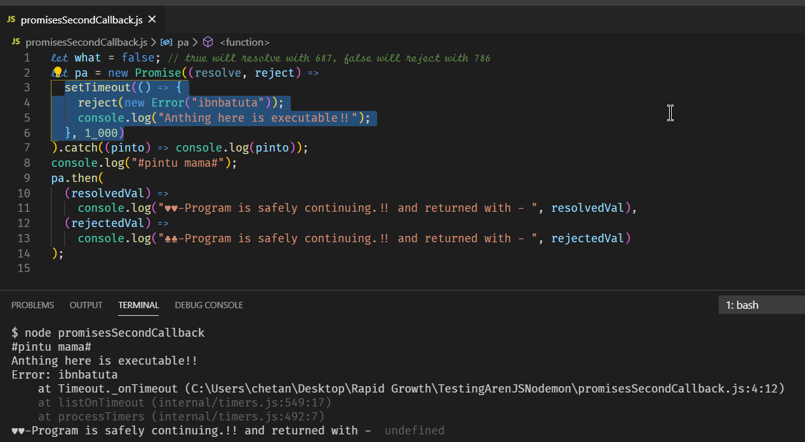

*

Using promises via function wrapped around -

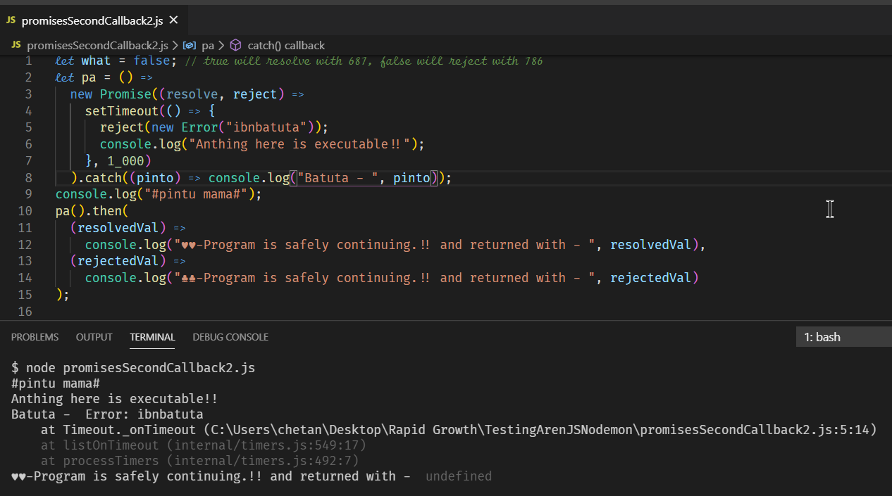

***

## Asynchronous Task in Serial Order**(or in sequential order)**:-

In other words another asynchronous task starts only when previous is resolved.
**example:**

```js
//Simple promise call:-
new Promise((resolve) => {
  setTimeout(() => console.log("tik-tick"), 1_000);
});

//Simple promise callback function:-
let fun = () =>
  new Promise((resolve) => {
    setTimeout(() => {
      console.log("tik-tick");
      console.log("processing-some-inside-operations");
      resolve("continuee");
    }, 1_000);
  });

fun().then((returned) => console.log("FINALLY AFTER 1 SEC, WE HAVE RECEIVED:",returned));
```

***

## Another e.g.

```js
//Promise with some parameter:-
let fun = (secs) =>
  new Promise((resolve) => {
	if(!secs) secs = 1
      setTimeout(() => {
      console.log("TIK-TICK:","minute:seconds",new Date().getMinutes(),":",new Date().getSeconds());
      resolve("continuee");
    }, 1_000*secs);
  });

//Promise resolving(Asynchronous Calling) in sequence/serially:-
fun().then((t) => {
  if (t === "continuee") {
    fun(1).then((t) => {
      if (t === "continuee") {
        fun(2).then((t) => {
          if (t === "continuee") {
            fun(3).then((t) => {
              if (t === "continuee") {
                fun(4).then((t) => {
                  if (t === "continuee") {
                    fun(5).then((t) => {
                      if (t === "continuee") {
                        fun(6);
                      }
                    });
                  }
                });
              }
            });
          }
        });
      }
    });
  }
});
```

**Pictorial form of above function:**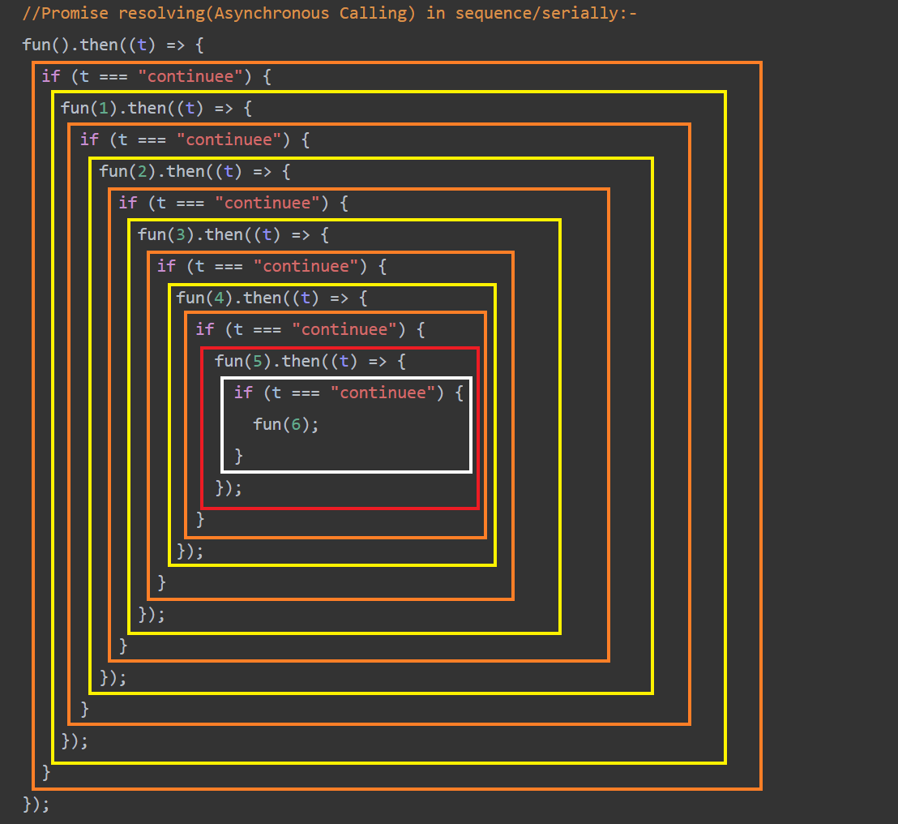

***

## Simple resolving and chaining process:

```js
new Promise(resolve => {setTimeout(() => resolve(3), 2000)})
        .then(d => (d*d)).then((ee)=> console.log(ee)) // first resolve returns whats inside it.
```

***

## Expertise in promises:

```js
//EXECUTE THE CODE IN ONCE IN CHROME CONSOLE.
flag = confirm('Press OK to resolve promise, Cancel to reject promise')
												//or manually assign true/false
let timeOutCountdown = 2
let timeOut= (secs) => {
   	for(let i=secs;i>-1;i--)
       	setTimeout(()=>console.log(i),(secs-i)*1000)
}
timeOut(timeOutCountdown)
let  rideHospital = new Promise((resolve,reject)=>{ 	// here resolve and reject are the methods to
    let futureExecution = () =>	{					  // to return appropriate values fed to them
    	if(flag){									// on some condition(mostly fetched 														   // asynchronously).
	        resolve(`Happy life, long life. Promise is RESOLVED bcoz you are awesome. FLAG: ${flag}`)
    	}
		else{
			reject(`BastardS drink everyday. Promise is REJECTED bcoz you are lazy. FLAG: ${flag}`)
            //you should definitely handle it, by providing .catch statement and fetch the above 				// rejected value from the promise, like below.
    	}
	}
    setTimeout(futureExecution,(timeOutCountdown+1)*1000)
})
rideHospital.then((value)=>console.log(value)).catch(err => console.log(err))
									//	err.name and err.message yield undefined.
console.log('\n\n\n\n\n\n\n\n\n\n\n\n\n\n\n\n\n\n\n\n\n\n\n\n\nFollow the confirm box:')
```

***

```
*The reason above code works without even declaring the flag, (as let flag; flag = false/true), is that if you don't declare they become become global variables. YES THEY DOOO.. ITS JS.
pLEASE READ: BELOW ARTICLE FOR JS PRACTISES.
```

[Javascript best practises, a must guide for every js developer. @ W3SCHOOLS.COM](https://www.w3schools.com/js/js_best_practices.asp)

```js

let  rideHospital = new Promise((resolve,reject)=>{ ..// here rideHospital is creator
rideHospital.then((coco)=>console.log(coco..// here rideHospital is consumer.
**
//ADDING .finally() IN THE PROMISE CONSUMER
rideHospital.then((coco)=>console.log(coco)).finally(()=>{console.log('.finallyexecuted')})  

***
PROMISE CREATOR AND PROMISE CONSUMER MUST BE DIFFERENT // consumer// only executes when promise is resolved, if fulfilled .then is EXECUTED followed by .finally AND IF rejected .catch is EXECUTED followed by .finally(()=>{...your code here// finally doesn't have a available parameter to deal with})

setTimeout(()=>console.log("hula"),1000)
setTimeout(()=>console.log("hula"),1000)
setTimeout(()=>console.log("hula"),1000)
setTimeout(()=>console.log("hula"),1000)
//execute above code in once, will cause to execute them altogher with a few milliseconds difference.

setTimeout(()=>console.log("hula"),1000)
setTimeout(()=>console.log("hula"),2000)
setTimeout(()=>console.log("hula"),3000)
setTimeout(()=>console.log("hula"),4000)
//execute above code in once.
Executing above statements works greater.

**** Actual TIMEOUT function:
let timeOut= (secs) => {
    for(let i=secs;i>-1;i--)
        setTimeout(()=>console.log(i),(secs-i)*1000)
}
timeOut(10)
//this creates a 10 sec timer.
```

# Define your own error:

```js
new Error('LOL Error')
Error: LOL Error
    at <anonymous>:1:1
new Error('LOL Error').name
"Error"
new Error('LOL Error').message
"LOL Error"
```

# Amazing promise example

```js
// run below code as once in chrome dev tools
new Promise((_,reject) =>
reject(new Error("Fail")))
    .then(value =>
console.log('handler 1'))
    .catch(reason => {
 console.log('caught failure ' + reason)
 return 'nothing'
})
.then(value => console.log('handler 2', value)) // lastly returned 'nothing' would be returned here as value
```


***

# **Scheduling: setTimeout and setInterval**

We may decide to execute a function not right now, but at a certain time later. That’s called “scheduling a call”.

There are two methods for it:

- `setTimeout` allows us to run a function once after the interval of time.
- `setInterval` allows us to run a function repeatedly, starting after the interval of time, then repeating continuously at that interval.

These methods are not a part of JavaScript specification. But most environments have the internal scheduler and provide these methods. In particular, they are supported in all browsers and Node.js.

## [setTimeout](https://javascript.info/settimeout-setinterval#settimeout)

The syntax:

```javascript
let timerId = setTimeout(func|code, [delay], [arg1], [arg2], ...)
```

Parameters:

- `func|code`

  Function or a string of code to execute. Usually, that’s a function. For historical reasons, a string of code can be passed, but that’s not recommended.

- `delay`

  The delay before run, in milliseconds (1000 ms = 1 second), by default 0.

- `arg1`, `arg2`…

  Arguments for the function (not supported in IE9-)

For instance, this code calls `sayHi()` after one second:

```javascript
function sayHi() {
  alert('Hello');
}

setTimeout(sayHi, 1000);
```

With arguments:

```javascript
function sayHi(phrase, who) {
  alert( phrase + ', ' + who );
}

setTimeout(sayHi, 1000, "Hello", "John"); // Hello, John
```

**Pass a function, but don’t run it**

Novice developers sometimes make a mistake by adding brackets `()` after the function:

```javascript
// wrong!
setTimeout(sayHi(), 1000);
```

That doesn’t work, because `setTimeout` expects a reference to a function. And here `sayHi()` runs the function, and the *result of its execution* is passed to `setTimeout`. In our case the result of `sayHi()` is `undefined` (the function returns nothing), so nothing is scheduled.

***

# Always work with let, unless you are required to use const, becozzz...

```js
let cars
let cars
//above two statements cause error as it is already declared// try executing both statement in once // try executing both statements one by one.

const cars = 20 
const cars = 20
//even const doesn't live in harmony even alone, i.e.,
const cars // even this statement will produce error, that initialization missing..
```

***

```js
let furu = (val) =>{
        setTimeout("console.log('hey yeahh');console.log('hey yeahh')",3000)
}
// ABOVE statement doesn't work, BUT BELOW ONE hits....

let furu = (val) =>{
        setTimeout("console.log('hey yeahh')",3000)
}
```

***

### You should never ever use status variable , in  node or  chrome dev tools, as it is in use by  the environment.

***

### [Canceling with clearTimeout](https://javascript.info/settimeout-setinterval#canceling-with-cleartimeout)

A call to `setTimeout` returns a “timer identifier” `timerId` that we can use to cancel the execution.

The syntax to cancel:

```javascript
let timerId = setTimeout(...);
clearTimeout(timerId);
```

In the code below, we schedule the function and then cancel it (changed our mind). As a result, nothing happens:

```javascript
let timerId = setTimeout(() => alert("never happens"), 1000);
alert(timerId); // timer identifier

clearTimeout(timerId);
alert(timerId); // same identifier (doesn't become null after canceling)
```

As we can see from `alert` output, in a browser the timer identifier is a number. In other environments, this can be something else. For instance, Node.js returns a timer object with additional methods.

Again, there is no universal specification for these methods, so that’s fine.

For browsers, timers are described in the [timers section](https://www.w3.org/TR/html5/webappapis.html#timers) of HTML5 standard.

***

## [setInterval](https://javascript.info/settimeout-setinterval#setinterval)

The `setInterval` method has the same syntax as `setTimeout`:

```javascript
let timerId = setInterval(func|code, [delay], [arg1], [arg2], ...)
```

All arguments have the same meaning. But unlike `setTimeout` it runs the function not only once, but regularly after the given interval of time.

To stop further calls, we should call `clearInterval(timerId)`.

The following example will show the message every 2 seconds. After 5 seconds, the output is stopped:

```javascript
// repeat with the interval of 2 seconds
let timerId = setInterval(() => alert('tick'), 2000);

// after 5 seconds stop
setTimeout(() => { clearInterval(timerId); alert('stop'); }, 5000);
```

**Time goes on while `alert` is shown**

In most browsers, including Chrome and Firefox the internal timer continues “ticking” while showing `alert/confirm/prompt`.

So if you run the code above and don’t dismiss the `alert` window for some time, then in the next `alert` will be shown immediately as you do it. The actual interval between alerts will be shorter than 2 seconds.

## [Nested setTimeout](https://javascript.info/settimeout-setinterval#nested-settimeout)

There are two ways of running something regularly.

One is `setInterval`. The other one is a nested `setTimeout`, like this:

```javascript
/** instead of:
let timerId = setInterval(() => alert('tick'), 2000);
*/

let timerId = setTimeout(function tick() {
  alert('tick');
  timerId = setTimeout(tick, 2000); // (*)
}, 2000);
```

The `setTimeout` above schedules the next call right at the end of the current one `(*)`.

The nested `setTimeout` is a more flexible method than `setInterval`. This way the next call may be scheduled differently, depending on the results of the current one.

For instance, we need to write a service that sends a request to the server every 5 seconds asking for data, but in case the server is overloaded, it should increase the interval to 10, 20, 40 seconds…

Here’s the pseudocode:

```javascript
let delay = 5000;

let timerId = setTimeout(function request() {
  ...send request...

  if (request failed due to server overload) {
    // increase the interval to the next run
    delay *= 2;
  }

  timerId = setTimeout(request, delay);

}, delay);
```

And if the functions that we’re scheduling are CPU-hungry, then we can measure the time taken by the execution and plan the next call sooner or later.

**Nested `setTimeout` allows to set the delay between the executions more precisely than `setInterval`.**

Let’s compare two code fragments. The first one uses `setInterval`:

```javascript
let i = 1;
setInterval(function() {
  func(i++);
}, 100);
```

The second one uses nested `setTimeout`:

```javascript
let i = 1;
setTimeout(function run() {
  func(i++);
  setTimeout(run, 100);
}, 100);
```

For `setInterval` the internal scheduler will run `func(i++)` every 100ms:

Did you notice?

**The real delay between `func` calls for `setInterval` is less than in the code!**

That’s normal, because the time taken by `func`'s execution “consumes” a part of the interval.

It is possible that `func`'s execution turns out to be longer than we expected and takes more than 100ms.

In this case the engine waits for `func` to complete, then checks the scheduler and if the time is up, runs it again *immediately*.

In the edge case, if the function always executes longer than `delay` ms, then the calls will happen without a pause at all.

And here is the picture for the nested `setTimeout`:

**The nested `setTimeout` guarantees the fixed delay (here 100ms).**

That’s because a new call is planned at the end of the previous one.

**Garbage collection and setInterval/setTimeout callback**

When a function is passed in `setInterval/setTimeout`, an internal reference is created to it and saved in the scheduler. It prevents the function from being garbage collected, even if there are no other references to it.

```javascript
// the function stays in memory until the scheduler calls it
setTimeout(function() {...}, 100);
```

For `setInterval` the function stays in memory until `clearInterval` is called.

There’s a side-effect. A function references the outer lexical environment, so, while it lives, outer variables live too. They may take much more memory than the function itself. So when we don’t need the scheduled function anymore, it’s better to cancel it, even if it’s very small.

## [Zero delay setTimeout](https://javascript.info/settimeout-setinterval#zero-delay-settimeout)

There’s a special use case: `setTimeout(func, 0)`, or just `setTimeout(func)`.

This schedules the execution of `func` as soon as possible. But the scheduler will invoke it only after the currently executing script is complete.

So the function is scheduled to run “right after” the current script.

For instance, this outputs “Hello”, then immediately “World”:

```javascript
setTimeout(() => alert("World"));

alert("Hello");
```

The first line “puts the call into calendar after 0ms”. But the scheduler will only “check the calendar” after the current script is complete, so `"Hello"` is first, and `"World"` – after it.

There are also advanced browser-related use cases of zero-delay timeout, that we’ll discuss in the chapter [Event loop: microtasks and macrotasks](https://javascript.info/event-loop).

**Zero delay is in fact not zero (in a browser)**

In the browser, there’s a limitation of how often nested timers can run. The [HTML5 standard](https://html.spec.whatwg.org/multipage/timers-and-user-prompts.html#timers) says: “after five nested timers, the interval is forced to be at least 4 milliseconds.”.

Let’s demonstrate what it means with the example below. The `setTimeout` call in it re-schedules itself with zero delay. Each call remembers the real time from the previous one in the `times` array. What do the real delays look like? Let’s see:

```javascript
let start = Date.now();
let times = [];

setTimeout(function run() {
  times.push(Date.now() - start); // remember delay from the previous call

  if (start + 100 < Date.now()) alert(times); // show the delays after 100ms
  else setTimeout(run); // else re-schedule
});

// an example of the output:
// 1,1,1,1,9,15,20,24,30,35,40,45,50,55,59,64,70,75,80,85,90,95,100
```

First timers run immediately (just as written in the spec), and then we see `9, 15, 20, 24...`. The 4+ ms obligatory delay between invocations comes into play.

The similar thing happens if we use `setInterval` instead of `setTimeout`: `setInterval(f)` runs `f` few times with zero-delay, and afterwards with 4+ ms delay.

That limitation comes from ancient times and many scripts rely on it, so it exists for historical reasons.

For server-side JavaScript, that limitation does not exist, and there exist other ways to schedule an immediate asynchronous job, like [setImmediate](https://nodejs.org/api/timers.html) for Node.js. So this note is browser-specific.

## [Summary](https://javascript.info/settimeout-setinterval#summary)

- Methods `setTimeout(func, delay, ...args)` and `setInterval(func, delay, ...args)` allow us to run the `func` once/regularly after `delay` milliseconds.
- To cancel the execution, we should call `clearTimeout/clearInterval` with the value returned by `setTimeout/setInterval`.
- Nested `setTimeout` calls are a more flexible alternative to `setInterval`, allowing us to set the time *between* executions more precisely.
- Zero delay scheduling with `setTimeout(func, 0)` (the same as `setTimeout(func)`) is used to schedule the call “as soon as possible, but after the current script is complete”.
- The browser limits the minimal delay for five or more nested call of `setTimeout` or for `setInterval` (after 5th call) to 4ms. That’s for historical reasons.

Please note that all scheduling methods do not *guarantee* the exact delay.

For example, the in-browser timer may slow down for a lot of reasons:

- The CPU is overloaded.
- The browser tab is in the background mode.
- The laptop is on battery.

All that may increase the minimal timer resolution (the minimal delay) to 300ms or even 1000ms depending on the browser and OS-level performance settings.

Historic article: https://javascript.info/settimeout-setinterval#canceling-with-cleartimeout

***

## status variable


```js
status = false
false
if (status){
console.log('its true actually')
}
VM8549:2 its true actually
undefined
status === false
false
//YOU DO NOT EVER WANT TO SEE THIS THING EVER IN LIFE, if yes remember never blame JS
```

***

```js
•Clear chrome developers tool's variables with command:
window.location.reload();// OR SIMPLY location.reload(); // actually reloads the page.// Actually you may use ctrl+l and reload instantly.

OR use braces to encode the code:
{
    ..code here....
}
```

***

```js
a*2
//NaN
```

***

[HOW TO RUN ASYNC JAVASCRIPT FUNCTIONS IN SEQUENCE OR PARALLEL](https://jrsinclair.com/articles/2019/how-to-run-async-js-in-parallel-or-sequential/)

***

# Serialization

The process whereby an object or data structure is translated into a format suitable for transferral over a network, or storage (e.g. in an array buffer or file format).

In [JavaScript](https://developer.mozilla.org/en-US/docs/Glossary/JavaScript), for example, you can serialize an object to a [JSON](https://developer.mozilla.org/en-US/docs/Glossary/JSON) [string](https://developer.mozilla.org/en-US/docs/Glossary/string) by calling the [function](https://developer.mozilla.org/en-US/docs/Glossary/function) [`JSON.stringify()`](https://developer.mozilla.org/en-US/docs/Web/JavaScript/Reference/Global_Objects/JSON/stringify).

[CSS](https://developer.mozilla.org/en-US/docs/Glossary/CSS) values are serialized by calling the function [`CSSStyleDeclaration.getPropertyValue()`](https://developer.mozilla.org/en-US/docs/Web/API/CSSStyleDeclaration/getPropertyValue).

***

# Set custom port for react server

```js
    "start": "set PORT=3009 && react-scripts start",
//in package.json
```

***

Chrome Dev TOols : Ctrl+ shift + j/i for elements/console OR••

 •F12 for Elements(Chrome dev tools.)

***

## Chrome Developer Tools

Change dock Style: Ctrl + shift + d. (Detach dock)

You may edit styes in html pages if they are located in some css file. Check all the .css files in website via pressing ctrl+p and typing .css and it will localte the .css files, Alternatievely you may click on the the line number mentioned in the right side css style panel in the elements tab. And from there you will be redirected to the file, so make changes there and you would be having an option to save the file via right clicking in the file after making the desired changes to the file, all changes you would make are hot updates, i.e., it updates as you type.

* Selecting an element in elements tab, you may press H to hide the element.
* You may click any element and select, scroll to view to move the screen on the item.
* You may add attributes like id and class to the element by right clicking.
* You may add focus: or hover: or visited or OTHER state to the element by right clicking on it.
* you may add the css classes for the elements right away in the right side STYLES section in the ELEMENTS tab, it features autocompletion, so all the related classes from the bootstrap will be there to autocomplete your softhand.
* YOu may do 
  `$('h1').style.color = 'blue'` in console insead of queryselector i.e., document.querySelector('h1').style.color = 'blue'
* Use console.error() in js to log errors to the console.
* and use console.warning() in js to log errors to the console.
* USE 'LIVE SERVER' FROM RITWICK DEY AND USE LIVE HOTRELOAD FEATURE. TO use it you must open the server via right clicking the file and select open with live server. OR Alt+L , O
* 

***

Ctrl + \ to split editor in VSCODE.

***

When you simply changes the theme, via pressing Ctrl + shift + p and searhcing for 'color theme' and setting theme, you are actually setting the theme for the local folder or workspace/workbench.

***

# JavaScript toFixed() Method

```JS
Math.random() // returns a number
//output: 0.18762558122571837 //17 digits after decimal. (sometimes its 15,16,18,etc)
var num = 5.56789;
var n = num.toFixed(2);
//output: "5.57"
var p = num.toFixed() OR num.toFixed(0) // assign the number of decimal digits
//The parameter is optional(if absent means 0) and can take value upto from 0 to 20(both including).
//output: "5"
Number("23445")
//output: 23445 // its number, whats suppied was string.
"2352.0".toFixed(2)//
//output: 2352.00
let car = 2345252
car.toFixed(2)
//output: "2345252.00"
Number(car.toFixed(2))
//output: 2345252
let car = 2345252.234
Number(car.toFixed(2))
//output: 2345252.23
-2.34.toFixed(1)       
// Returns -2.3 (due to operator precedence, negative number literals don't return a string...)
(-2.34).toFixed(1)     
// Returns '-2.3' 

_
Number(232525)
232525
Number(232525.00000000)
232525
Number(232525.000000001)
232525.000000001

_
function circumference(r) {
  return parseFloat(r) * 2.0 * Math.PI;
}

console.log(circumference(4.567));
// expected output: 28.695307297889173

console.log(circumference('4.567abcdefgh'));
// expected output: 28.695307297889173

console.log(circumference('abcdefgh'));
// expected output: NaN

parseFloat(23.99999999999990001).toFixed(13)
//Output: "23.9999999999999"
that'S ENOUGH PLAYING WITH Number()
```

***

# Favourite Theme:

SWITCH THEMES INSTANTLY VIA, 

### CTRL+K CTRL+T 

**Themes**: Monokai is FAVOURITE, 
Monokai Dim (is like more off blue and off colours)

* For backend: Kimbie Dark (is like browninsh)

***

alt + <space> , c >> CLOSE WINDOW, 
ctrl+k, f >> closing a folder/workspace. (release ctrl after pressing k), 
Ctrl+k Ctrl+o >> open a folder dialog box.
Alt+f, Alt+k >> open a workspace dialog box.

***

```
try {
  Block of code to try
}
catch(err) {
  Block of code to handle errors
}
```

***

# Add typechecking to js files(with ts checking)

```json
  "javascript.implicitProjectConfig.checkJs": true
// add the above line the user settings.json file in the end before the last closing brace.
-[there are two settings.json >> user>settings.json and work>settings.json, do edit with your preference.]
//TO OPEN SETTINGS.JSON FILE, just search for "json" in search settings pallete.
//ALSO YOU'LL NEED TO SPECIFY -
//@ts-nocheck or @ts-expect-error
```

***

# Set icon-theme in vscode

"File Icon Theme" in settings search pallette, and set **Seti (Visual Studio Code)**

***

# JavaScript Switch Statement

```js
switch(expression) {
  case x:
    // code block
    break;
  case y:
    // code block
    break;
  default:
    // code block // if no case is mathced, then default case is executed.
}
This is how it works:

The switch expression is evaluated once.
The value of the expression is compared with the values of each case.
If there is a match, the associated block of code is executed.
```

***

## Amazing article on Static language and Dynamic language

https://hackernoon.com/i-finally-understand-static-vs-dynamic-typing-and-you-will-too-ad0c2bd0acc7

***

## Another article on same topic 

https://www.sitepoint.com/typing-versus-dynamic-typing/

***

INshorts: 

## Strong vs. weak Typing :

Programming languages that exhibit "strong typing" are "strong typed," and those that exhibit "weak typing" are "weak typed".

Programming languages in which variables have specific data types are strong typed. This implies that in strong typed languages, variables are necessarily bound to a particular data type. Python is strong typed, and so is Java.

##### Static Typed or Dynamic Typed?

There are advocates of both forms of typing. Asserting that one is better than the other would only lead to a debate of no consequence.

There are those who advocate dynamic typing for the simplicity and saving in terms of time that it offers; they believe that type checking need not be an integral part of the programming language design per se, but instead, that third-party solutions (like pychecker) could be used to server that purpose.

On the other hand, there are advocates of static typing, who believe that static typing (leading to forced variable declaration) is an important requirement of programming language design.

***

# **IMPORTANT TO LISTEN EVERY TIME**

```
STATIC, DYNAMIC LANGUAGES. 
STRONG AND WEAK TYPED LANGUAGES.
JS IS DYNAMIC AND WEAK TYPED. Whereas python is dynamic and strong typed lang.
**
Javascript doen't compile. It is interpreted/scripting/dynamic language, it is converted to machine code at runtime. Whereas other languages              

# Javascript is WEAK TYPED as it doen't have different variable types. There is a single data type i.e., object. Whereas in STRONG TYPED, there are different variable types like string, array, object,etc.

# Javascript is DYNAMIC LANGUAGE as till runtime you don't know the errors, such as undeclared variables, but will show the errors at runtime.			 Whereas in STATIC languages, the code won't even compile if undeclared variable is in use.
```


***

Typescript is need for cathcing errors and failed assumptions about the code at the coding time.

It helps in static typing, classes, modules.

***

 MS has extended JS to include a type system and compiled it down to plain JS. The translation layer is much more coherent.

```js
true + true
//ouput: 20
```

***

public static int Model

Statements live aboe in java have the keyword static, tells the compiler intiate the variable Model with 0.

***

```
Car.prototype.constructor
//output: the complete class of the car is printed as it is.


Hoisting
Unlike functions, and other JavaScript declarations, class declarations are not hoisted.

That means that you must declare a class before you can use it 	


JavaScript Classes are written in "strict mode"
You will get an error if you try to use a variable without declaring it.

Press F12 to see the error description in the console.
```

https://www.w3schools.com/js/js_classes.asp

***

## Using function to return desired objects:

```js
const cars = (name, model) => { return {"carName":name, "carModel":model}}
let newCar = cars('hyundai','2011')
newCar// output:=>
{carName: "hyundai", carModel: "2011"}
```

***

# Does code execute after returnin once:

```js
let carl = () => {
if(true)
return 23
console.log('after initial return')
return 25
}
undefined
carl()
23
```

***

## npm install doesn't install devDependencies

```js
// packages under devDependencies doesn't get installed when you do a npm install on the project.
You have to install them with:
npm install --only=dev// works greattt // also // npm install --only=prod // will install general dependecies only
//above statement will install all the dev dependencies in the project, but not the general ones.
```

***

```js
return { ...state, good: state.good+1 };
return { ...state, good: state.good++ };
// out of the above statements, 2nd statement doesn't work.
```

***


This error is resolved via putting below line in .env file.

```
SKIP_PREFLIGHT_CHECK=true
```

Moral of the story, always install dependencies locally(in this case if you hadn't installed the jest globally it would not have caused the probem)

****

## You should run testlocally via npm test <optional-regexpattern>, 

```js
npm test <optional-regex-pattern> // this works.
    // using below pattern would cause the globally installed jest to function// although it is only for projects created with create-react-app.
    jest 
	or 
	jest <optional-regex-pattern>
        
#all above doesn't work because react comes with jest setup inbuilt.
#in all other backend projects, you may use jest as usual, like jest <regex-pattern>
```

***

## just to know

```js
$ npm test -v
6.9.0

chetan@insidebug MINGW64 /c/FullstackopenProjects/unicafe-redux
$ npm -v
6.9.0
```

***

# You should test projects creaed from create-react-app as it supports to be tested by react-scripts test command only that supports only the verion of jest that comes with it internally.

```
.env file
#SKIP_PREFLIGHT_CHECK=true 
# above line only need to be uncommented if you have installed jest locally, as projects created with create-react-app have jest inbuilt, you don't need to install it explicitly.
#The inbuilt jest with react-scripts can be used via `npm test` or `react-scripts test`.
```


```js
it doen't matter if you install jest locally, or globally, or not intall jest at all.
As react projects comes with built in jest that is configured, and to test use 
npm test <optional-regex-pattern> 
or
react-scripts test <optional-regex-pattern>
# SO  YOU SHOULD PREFER TO KEEP .env file in projects created with create-react-app, and put 
SKIP_PREFLIGHT_CHECK=true 
in that file, THAT WILL allow THE `npm test` to use the version of jest insides the node modules which was created by the earlier create-react-project, keeping the other vesion installed too(that is listed in the package.json). Also, if you havent installed any jest additionally(in dependencies, or dev-dependencies), you don't need to do this in .env file. 

@@Also, if you do `npm ls jest`
// IT shows you the dependency tree for the current project.
$ npm ls jest
unicafe-redux@0.1.0 C:\FullstackopenProjects\unicafe-redux
+-- jest@25.3.0		// it is showing this bcoz I had installed jest via `npm i jest --save-dev`
`-- react-scripts@3.0.1
  `-- jest@24.7.1

//AFTER removing jest dependency from the package.json and doing `npm install` again, and then doing `npm ls jest` // shows that it has uninstalled the locally installed version of jest
$ npm ls jest
unicafe-redux@0.1.0 C:\FullstackopenProjects\unicafe-redux
`-- react-scripts@3.0.1
  `-- jest@24.7.1

```

****

## Uninstalling dependies in node

```js
The command is simply npm uninstall <name>

The Node.js documents https://npmjs.org/doc/ have all the commands that you need to know with npm.

A local install will be in the node_modules/ directory of your application. This won't affect the application if a module remains there with no references to it.

If you're removing a global package, however, any applications referencing it will crash.

Here are different options:

npm uninstall <name> removes the module from node_modules but does not update package.json

npm uninstall <name> --save also removes it from dependenciesin package.json

npm uninstall <name> --save-dev also removes it from devDependencies in package.json

npm uninstall -g <name> --save also removes it globally
@StackoverFlow
```

***

## Online node execution , node playground, node online,

https://www.katacoda.com/courses/nodejs/playground

amazing than ever:

https://repl.it/languages/nodejs <= this is what you actually require, and this has support from github, and also enables collaboration. Although, in vscode you have collaboration pluging from microsoft itself, is much more impressive. But you need to login with google/facebook to be able to collaborate with people with a link, and the other person also has to make account via google. The good news is you don't need to verify manually via email.

https://codesandbox.io/ - amazing templates for making projects at tips, save your templates there.

***

## Find out the NODE_ENV VARIABLE

If you have defined `NODE_ENV` variable then you should be able to see this by typing `node` in the command prompt which will open the node cell and then type `process.env.NODE_ENV`.

To check the existing env variables .. type this .. `process.env`

You can only get the value of NODE_ENV if you have defined it in your enviornment.

***

## Using .env variables with react

You don't need to install `dotenv` for your project explicitly, its already packed with creat-react-app, and you don't need to to import  anyfile too.

```JS
.env file >>
REACT_APP_VARIABLE_A=CARS
REACT_APP_VARIABLE_B=SUSUZUKI
NODE_ENV=TESTIFYYY // even though you specify NODE-ENV, it won't change, its not allowed. React itself sets this flag.

ANY FILE THAT WANTS TO ACCESS THE VARIABLES FROM .env FILE // You have to KILL, AND npm start agian.
console.log(process.env)
console.log(process.env.REACT_APP_VARIABLE_A);
console.log(process.env.REACT_APP_VARIABLE_B);

```

***

```js
undefined
>> undefined

"undefined"
>> "undefined" //output 1

typeof undefined //type of returns an string -> "undefined"
>> "undefined" //output 2

#UNDEFINED TESTING:
typeof undefined === "undefined" //Since output 1 and output 2 are equal, hence this evaluates-> true
>> true
if(typeof ghost === "undefined"){ // both double and trippe = operator works
console.log('GHOST WORLD')
}// PRINTS 'GHOST WORLD' for undefined variables, without any reference error.

#NULL TESTING(WORKS)
null == undefined // double operator
>> true
null == null // double operator
>> true
null === null // tripple
>> true
null === undefined
false // as without type conversion, null is an object.

#SINGLE FUNCTION TO CHECK BOTH NULL, UNDEFINED
if(typeof ghost === "undefined" || ghost === null){ // all works
console.log('GHOST WORLD') // all works
} // all works

#failing test...
if(ghost == null || ghost == undefined){ 
console.log('GHOST WORLD')
}		// since the above code SEEMS to be working, BUT IT DOESN'T if variable is undefined, as it throws error Reference error, from which we are rescuing.
```

***

## You should never delete package-lock.json file or alter it ever.

https://stackoverflow.com/questions/54124033/deleting-package-lock-json-to-resolve-conflicts-quickly

Yes, it can and will affect all the project in really bad way.

1. if your team does not run `npm install` after each `git pull` you all are using different dependencies' versions. So it ends with "but it works for me!!" and "I don't understand why my code does not work for you"
2. even if all the team runs `npm install` it still does not mean everything is ok. at some moment you may find your project acts differently. in a part that you have not been changing for years. and after (probably, quite painful) debugging you will find it's because of 3rd level dependency has updated for next major version and this led some breaking changes.

Conclusion: don't ever delete `package-lock.json`. in your case you better do next way:

**Approach 1**

1. revert your changes in `package-lock.json`
2. `stash` your changes
3. `pull` most recent code version
4. run `npm install` for all the dependencies you need to be added
5. unstash your changes.

**Approach 2**

1. run merging
2. for conflict resolution choose "their changes only" strategy on `package-lock.json`
3. run `npm install` so dependencies you want to add are also included into `package-lock.json`
4. finish with committing merge commit.

PS yes, for first level dependencies if we specify them without ranges (like `"react": "16.12.0"`) we get the same versions each time we run `npm install`. But we cannot say the same about dependencies of 2+ level deep (dependencies that our dependencies are relying on), so `package-lock.json` is really important for stability.

```JS
resolve quickly my way..
Download the older package-lock.json file and PLACE it in the project folder.
>> rm -rf node_modules
>> npm install
```

Also, you can read more here..

https://medium.com/coinmonks/everything-you-wanted-to-know-about-package-lock-json-b81911aa8ab8

***

## Best way to sort an array of object with each object having property votes

```js
stateTemp.sort((a, b) => b.votes - a.votes)
```

***

## process.env in create-react-app projects

```js
console.log('****:**')
console.log(process.env.REACT_APP_NODE_ENV)
console.log(process.env)
console.log('*****')
```

***

Focus from chrome developers tools to page >> tab

From **page** to **chrome developers tools**  >> shift+tab, tab, tab, tab, tab till you reach dev tools.

***

Goto a line 21 with column number 22

```js
:21:22
```

***

## Go to symbol in current workspace: 

Ctrl + T, type the filename/functionname/variablenaeme

Ctrl + E, go to file. (also use sometimes.)

***

## Search text within a text string

```js
CASE-SENSITIVE SEARCH WITHIN STRING
'A string to test JavaScript string methods'.indexOf('string')
//Output: 2 // returns the index of the starting character of the given text

'A string to test JavaScript string methods'.indexOf('to test Java')
//Output: 9 // returns the index of the starting character of the given text

'A string to test JavaScript string methods'.indexOf('kaka')
//Output: -1 // for no any text that is not there in the string.

CASE-INSENSITIVE SEARCH WITHIN STRING
'A string to test JavaScript string methods'.search(new RegExp("JAVA", "i"))//i is for insensitivity
//Output: 17 // instead of the "JAVA", YOU COULD USE A STRING VARIABLE SMOOTHLY.

'A string to test JavaScript string methods'.search(/JAVASCRIPT/i) // you CANNOT USE string here
//Output: 17

'A string to test JavaScript string methods'.search(/JAVASofCRIPT/i) // you CANNOT USE string here
//Output: -1

'A CAR string to test JavaScript string methods'.search(/caR/i) // you CANNOT USE string here
//Output:  2
// STRING Search method accepts a single argument: a pattern to search for in the string it is invoked on. This argument can be a regular expression or a string, which will automatically be converted to a regular expression. The search method is similar to the indexOf and lastIndexOf methods in that it returns the location of the first found match, or -1 if it is not found. We demonstrate with a case-insensitive search using the same string 
```

[Source Link](https://www.dyn-web.com/javascript/strings/search.php), [Source Link 2@w3school](https://www.w3schools.com/jsref/jsref_regexp_i.asp)

***

Dollar Bracket:

```js
# There should be no space between $ and the {}.
Like, $ {someVariable} is not allowed, it doesn't give error, and doesn't work too.
Rather, ${someVariable} works good.
```

***

## Instead of npm install, you can do npm i, too.

***

Managing different remotes in the same repo with the help of different branches.

***

```bash
chetan@insidebug MINGW64 /c/FullstackopenProjects/redux-anecdotes
$ jest -v
24.8.0

chetan@insidebug MINGW64 /c/FullstackopenProjects/redux-anecdotes
$ cd ..

chetan@insidebug MINGW64 /c/FullstackopenProjects
$ jest -v
25.3.0
```

***

## Option to add braces to arrow function:

Place cursor between 

```js
const getId = () => (100000 * Math.random()).toFixed(0);
	  after first = and before '>'.
```

Press ctrl+.

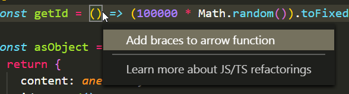

Same goes the other way:

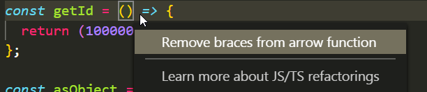

****

## Amazing code snippet which I was working upon long before..

```js
let abhi = () => {
    setTimeout(() => {console.log('message is here...');setTimeout(() => {console.log('message is here...');if(flame)setTimeout(() => {console.log('message is here...');setTimeout(() => console.log('message is here...'),4000)},3000)},2000)},1000)   
}
flame =false // execute this too if you want to stop it mid way...
flame =true // exeute this too if you want to be unstoppable
abhi()
```

***

## Infinite recursive function:

```js
let lamha = () => {
    setTimeout(()=> {{console.log('I\' executing...',new Date().getSeconds()); if(andha) lamha()}},2000)    
}
let andha = true
lamha()
// Output: this function will execute forever unless YOU SPECIFY andha to be false IN THE RUN TIME OR LATER TIME WHEN YOU WANT THE LOOP TO DISCONNECT.
```

***

## When your react server is on, you may not hung up the server to install any package, instead you can install in other terminal session

***

## To disable automatic browser opening the desired url

You can run `BROWSER=none npm start` or 
create an `.env` file with `BROWSER=none` in it to prevent the browser from opening.

***

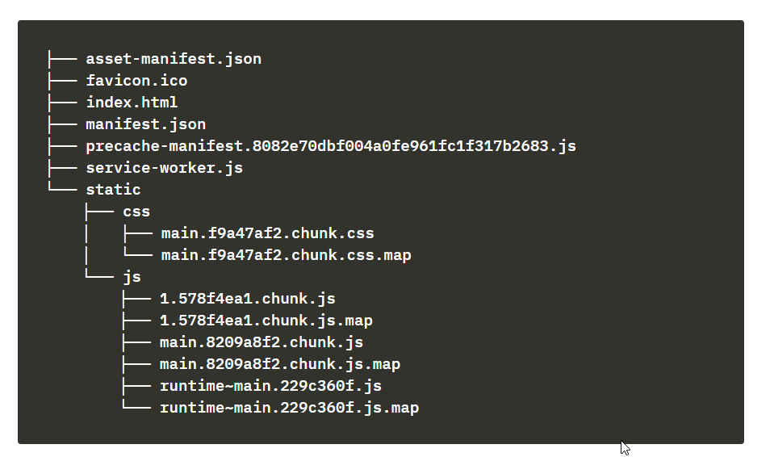

File structure, for npm run build in the create-react-app.

***

### Miracle Tragedy:

```js
const foo = {}
foo.a = 10 //successful
**
foo.b.c = 10 //error is thrown
//Uncaught TypeError: Cannot set property 'c' of undefined
**
foo.d = {e:10} //successful
**
foo.m = {}
foo.m.n = 10 //successful
```

***

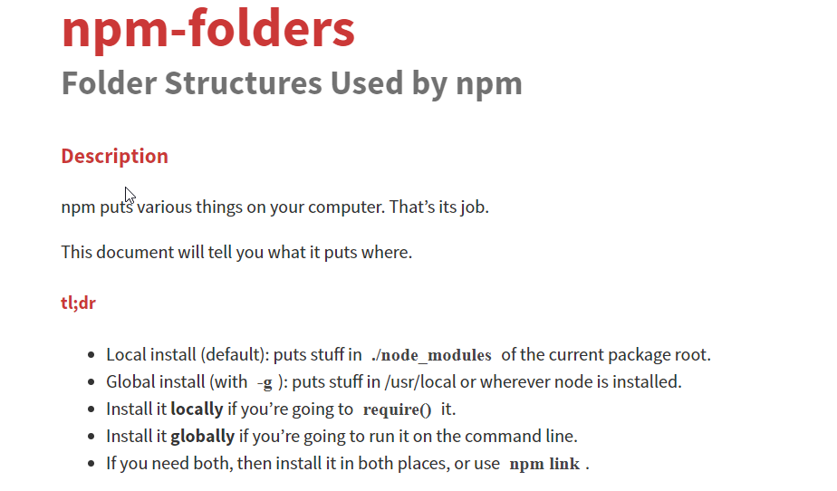

***

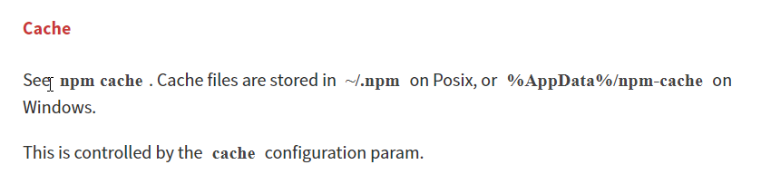

***

of JSON input while parsing near '...s":"^2.0.2","fs-extra' >> while doing 

```js
npm install css-loader
```

***

Doing npm cache clean --force will clear most of the contents in the **npm-cache** folder in %appdata%

***

```js
car = ['i10','i20','i30']
(3) ["i10", "i20", "i30"]
for(i of car){
console.log(i)
}
```

***

car ={}

***

```js
Math.floor(22.342)
//Output: 22

_
let num = 5.56789;
let n = num.toFixed(2); // Roundoff after two decimals
//Output: 5.57

_
let a = 10
a.toFixed(2) // Number(10).toFixed(2) // would be equally equivalent.
"10.00"
```

***

## Lodash

```js
console.log("###", _.countBy(["foo", "man", "chew", "bar", "bar"], (t) => t));
//Output:   ### { foo: 1, man: 1, chew: 1, bar: 2 }
```

```js
const desiredAuthor = _.head(_(authors).countBy().entries().maxBy(_.last)); 
  // using lodash, we find author(string) who occured most in the authorList(string array i.e., ['sahil','mohit','sahil','anuj']).
```

Using lodash is weird, you can not console.log everthing to test the desired result.

Better option is to keep reference of use-cases of lodash from the examples online.

***

## Include

```js
console.log(['joe', 'jane', 'mary'].includes('jane')); //true
```

***

Windows Switching: Ctrl + Alt + Tab, 

Alt+Tab, 

Alt+Esc(works best when you have two or three windows opened)

***

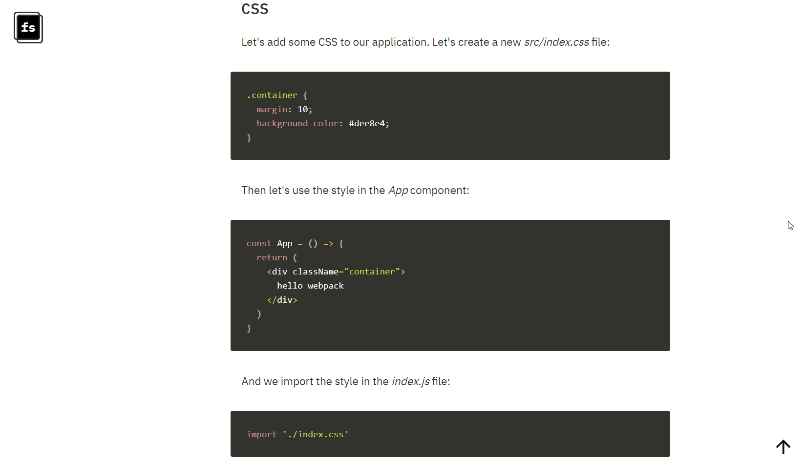

***

### Webpack has to be restarted when we make changes to its configuration file. It is also possible to make webpack watch for changes made to itself but we will not do that this time.

***

## Size vs. size on disk:

1.Size is the actual byte count of the file while size on disk is the actual byte count that it occupies on the disk.
2.Size on disk is usually bigger than the actual size of the file.
3.Size on disk can be smaller than the actual size for drives that use compression.

***

If we inspect the contents of the bundle file, we notice that it could be greatly optimized in terms of file size by removing all of the comments. There's no point in manually optimizing these files, as there are many existing tools for the job.

The optimization process for JavaScript files is called *minification*. One of the leading tools intended for this purpose is [UglifyJS](http://lisperator.net/uglifyjs/).

Starting from version 4 of webpack, the minification plugin does not require additional configuration to be used. It is enough to modify the npm script in the *package.json* file to specify that webpack will execute the bundling of the code in *production* mode:

```js
    "build": "webpack --mode=production",
    "start": "webpack-dev-server --mode=development"
```


***

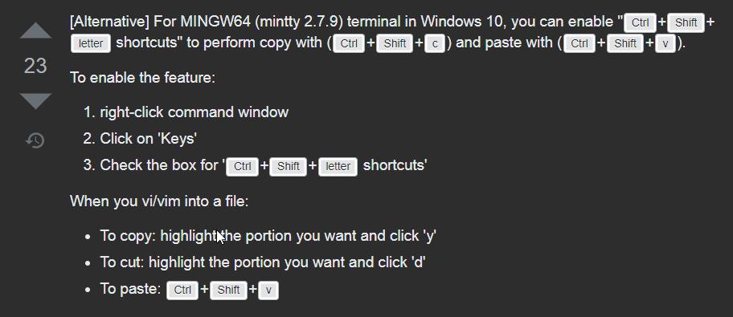

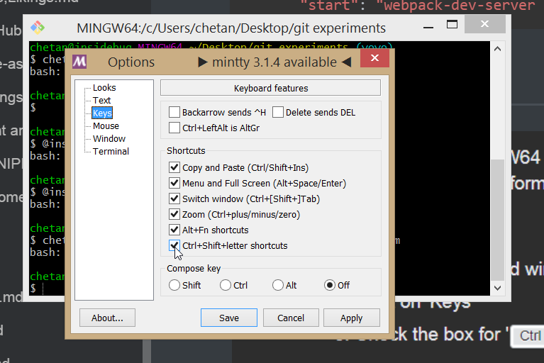

***

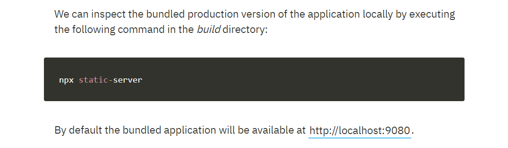

***

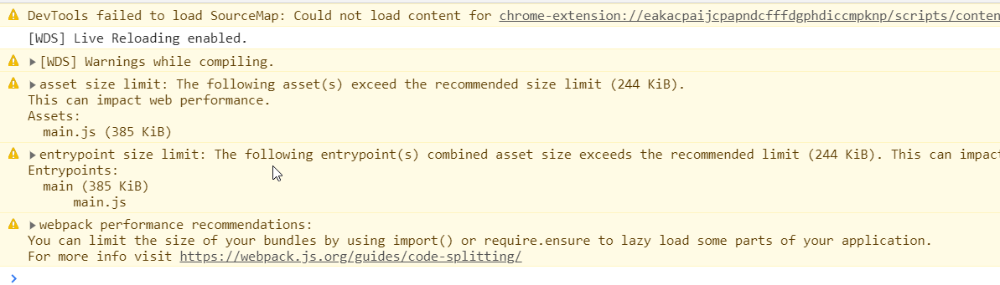

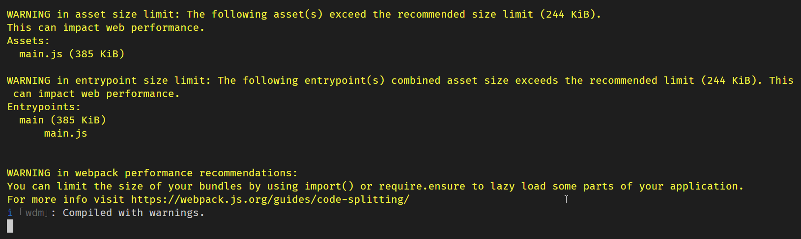

Solve this by below method:::

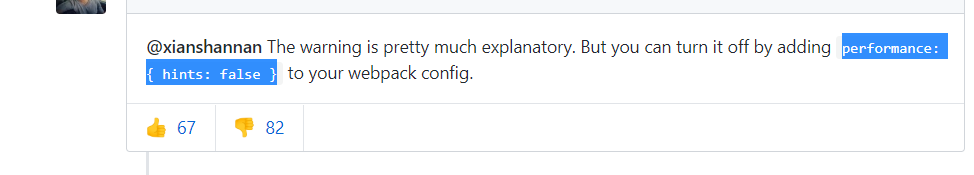

Hide this warning by:-

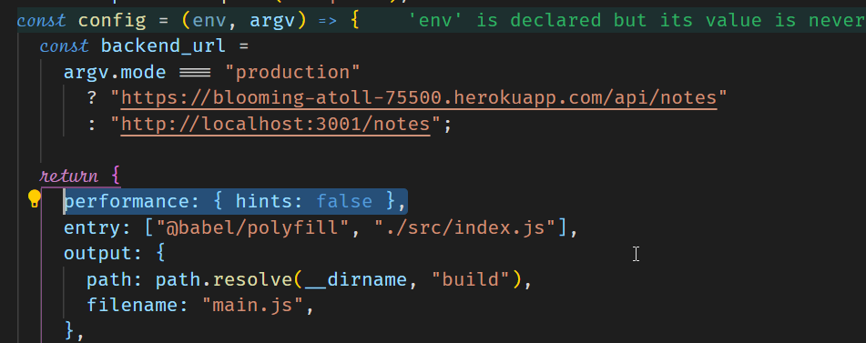

***

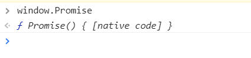

***

## Node online environment:

https://npm.runkit.com/

***

## Webserver on npm: 

## => Always prefer: browser-sync or live-server

And remember you can directly use a child directory to serve like, 

```bash
$ live-server folder_name
```

live-server - It **opens the url** at which the folder is server when **you execute the live-server command** in a folder automatically.[command - $live-server]

**Directory Listings support:** live-server, http-server,  No-> static-server, No -> lite-server

**Hotreload Support:** live-server(works on mobile browsers too(**tested - redmi note 5**)), lite-server(*[this tool shows  Browser Sync connected everytime the page is refreshed, so could be a little annoying]works on mobile browsers too(**tested - redmi note 5**)), NO -> static-server(but manual refresh does work), NO ->http-server(but manual refresh does work)

```bash
1. static-server # npm i -g lite-server (doesnt support directory listings)
2. http-server <directory> OR http-server . OR http-server (with no arguments) # npm i -g lite-server
3. lite-server #Slowest App(in terms of starting the application) npm i -g lite-server  #** WITH HOTRELOAD
#Warning lite-server takes time to start its server, you must use live-server.
4. live-server # npm i -g live-server, + WITH HOTRELOAD, + `live-server folder_name` works.
5. serve # npm i -g serve, +Directory listing support(though root of drive can't be shared)
6. npx browser-sync start --server --files "./*.html" --no-open --no-notify --directory
# npm install -g browser-sync, + Directory listing support. #BEST!!
```

- browser-sync [Docs](https://browsersync.io/#install
- FYI: serve is made by [vercel](https://github.com/vercel/serve).

- lite-server --baseDir="dist"

***

Ctrl+ k Ctrl+ S will show you all the shortcuts(keybindings).

Ctrl + k, z : Will open zen mode, distraction free mode. Press double esc to exit out.

Ctrl + k, m : Will open change language mode.

***

## Better comments: (paste below code in js file)

```js
// simple comment
// // stricked comment
// ? 
// !
// * I love to do things here.
// todo: 
/** to use this type of commenting just type /** and it will show the intellisense
 * @param tomi 
 */

```

## Color Highlight:

```js
const color23 = '#12ff12'
```

## Image Preview:

```js
const image = 'https://in.bmscdn.com/iedb/artist/images/website/poster/large/pawan-kumar-3553-24-03-2017-17-34-29.jpg'
const image2 = 'https://i.ytimg.com/vi/zk3dljvlG0U/maxresdefault.jpg'
```

## Paste json as code;

```json
{
    car:'alto'
}
```

If you would try, the above code you would get error i.e., clipboard doesn't contain valid json code.

But if you format the code with prettier, i.e., paste the above same json to file and save with Ctrl+s, then it will properly format it to:-

```js
{
  "car": "alto"
}
```

and now you can paste the above json, via paste json as code in any file.


## Debugging

It is the best thing, **use debugger as pressing F5** (**fn+F5** will actually work). It will pause at break points, to start again, press F5(fn+F5 will work actually), and will pause at break point, to start again press F5(fn+F5 will work actually). 

## Run without debugging:

#### Ctrl + F5

-

To Set the default testing environment, you need to create the testing laungh.json file that includes all the necessary details regarding the debugging. This can be done easily with the help of menu, under debug in Activity Bar. Or press : **Ctrl + Shift + D (to open the debug menu in the Activity bar)**. And then you create the launch.json file for the debugging easiness. Like below(the second blue link):-

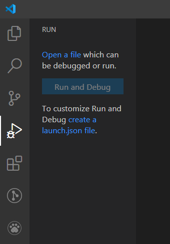

To any time **stop the debugger**: press **shif+F5** (without fn key will work.)

### ALSO: you can type the variable names to their value evaluated at the time.

ALSO: when the line is encountered i.e., the line is highlighted(when paused at break point), debugger has stopped at the start of the line. So, you can access all the data before that line via variables.

**Remove all breakpoints: Alt, R, A**

To **add a single** breakpoint: just press **F9.**
To **remove a single  breakpoint**: just press **F9**.

**Making many Breakpoints at once**: Place cursors at desired places via pressing and holding Alt key(will enable multiple cursors) and then **press F9 (fn + F9 will work actually)**.

You may use chrome debugger as environment for the debugger to debug inside the chrome browser.

***

Important [npm commands](https://gist.github.com/ankurk91/48e0844320601ebc0cae#update-npm-itself)

```bash
NPM PACK, NPM-PACK-ALL,:
_    
# Personal Project with production dependencies(to include developmetn devs: --dev-deps)    
failed-failed-failed-failed-failed-failed
// Installation: npm i -g npm-pack-all
npm-pack-all // do in any project(should have package.json file)
npm-pack-all --dev-deps // do in any projecgitt(should have package.json file)
tar -xzf <.tgz file> // to extract the .tgz file
tar -xzf <.tgz file> -C <desired directory to extract>
Getting urgent help:-
tar --help | grep "\-C"
HELP:  -C, --directory=DIR        change to directory DIR
  //if the above one doesnt work, use tar -xf <.tgz file>
mv package <the project name you want>
#ABOVE METHOD IS THE BEST(as it saves us from the installation time from the internet)

_
#List all dependecy tree in node_modules folder
npm ls

_
# NPM PACK (ignores the node_modules folder(thus doen't pack the dependent devps))
$ npm pack axios // will download the axios tarball(.tgz) to current folder.
// (doesn't pack the dependencies, so use for dependecies, but this is a good way to pack a personal project without dependencies)
$ npm pack lodash // will download the axios tarball(.tgz) to current folder.
$ npm pack axios lodash ..as_many_you_want

_
# To install these packages in your local node_modules folder:
$ npm i <location to tgz file> // you cannot install personal projects as dependencies(it has to have index.js file in the root of the )
(above command may give error in mingw, but command prompt will never output any error.)

_
# Personal Project(the only objecttive is backup/save/share in a feasible manner):
npm pack // will pack the project in .tgz file
tar -xzf <.tgz file> // will extract the project files(will have a single package folder)
mv package <the project name you want>
	^renamed-to^


_
# NPM VIEW
$ npm view <package-name> // will output package details and link to the tarball(.tgz file of the package).
$ npm view axios
$ npm view lodash


_
# extras:
To extract the package:(this is not much useful, as you may use winrar to extract)
$ tar -xzf lodash-4.17.4.tgz
$ tar -xzf axios-0.19.2.tgz

# Know where is your global forlder:
npm config get prefix // in command or bash
//output=> C:\Users\chetan\AppData\Roaming\npm
```

***

# **#Using tar, #tarball,** 

```bash
$ tar -czvf <new file.tgz or file.tar.gz> <content to be archived> 
#Creates .tar.gz file(.tar.gz and .tgz are different extension representaion for same data type)
	$(tar -czvf simpletar.tar file1 file2 dir1 dir2)
$ tar -xzvf <.tgz file> #extracts the .tgz file to current folder
$ tar -xvf <.tgz file> -C package #extracts in package folder
```

Here’s what those switches actually mean:

- -c: **C**reate an archive.

- -z: Compress the archive with g**z**ip.

- -v: Display progress in the terminal while creating the archive, also known as “**v**erbose” mode. The v is always optional in these commands, but it’s helpful.

- -f: Allows you to specify the **f**ilename of the archive.

- * -C set desired target location for extraction of the .tgz file

  

  # **#Best way and only way to compress to npm project:**

  [link helped](https://stackoverflow.com/questions/1371261/get-current-directory-name-without-full-path-in-a-bash-script) ; [link helped2](https://www.thegeekstuff.com/2010/05/bash-variables/); ==your project directory name should not have spaces.==

  ```bash
  tar -czf ${PWD##*/}"-project_backup".tgz ../${PWD##*/}
  ```

  or:-

  ```bash
  result=${PWD##*/}
  tar -czf $result"-project_backup".tgz ../$result
  ```

  Below is a personal script to package the project. If the current directory has mypackage.tgz file already, it would be replaced by the new one.

  ```bash
  mkdir -p ../packageX
  cp -r * ../packageX/
  tar -czf mypackage.tgz ../packageX
  rm -rf ../packageX
  #Your project file has been generated with name mypackage.tgz
  ```

  Below script uses mv, and its fast, but must never actually use it, as it could lead to loss of files when the project files are in use at the time execution:

  ```bash
  # never use this one.
  mkdir package
  mv * .* package
  tar -czf mypackage.tgz package
  mv package/* package/.* .
  rmdir package
  echo "this line is inted to let the last line execute"
  ```

  

  ### Using tar with no compression(almost the same size of the contents)

  ```bash
  tar -cvf simpletar.tar <file/dir> <file/files> <<more files to archive..>>
  tar -xvf simpletar.tar # will extract to current folder.
  tar -xvf simpletar.tar -C dest # will extract to dest folder.
  ```

  ## mkdir

  ```bash
  mkdir -p /var/path/to/your/dir
  # creates all the required directories
  ```

  

  ***

  ## #Moving in teminal #Bash, #moving in cmd, #moving cmd,#move all files, # move everything, #move files, #move all files, # move hidden files 

  ```bash
  Syntax:
  $ mv [file/files] [directory]
  
  $ mv package/* . # this will move all the files from the package to the current directory(except the files starting with .)
  
  $ mv package/.* . # this will move all the files from the package to the current directory(only the files starting with .)
  
  $ mv package/.* package/* . # this will move all the files from the package to the current directory (includes ALL FILES).
  # All in addition to the moving you'll get the acceptable errors i.e.,
  # 1. mv: cannot move ‘from/.’ to ‘to/.’: Device or resource busy
  # 2. mv: cannot remove ‘from/..’: s  directory
  ```

  ```bash
  rm -rf * .*
  # will remove all files, and files starting with .
  ls -a
  # will show all files, hidden files too.
  ```

  

***

## You can check how up to date your dependencies are using the command

```bash
npm outdated --depth 0
```

The npm [audit](https://docs.npmjs.com/cli/audit) command can be used to check the security of dependencies.

```bash
npm audit
```

```bash
// Let's run npm audit fix as the report suggests:
npm audit fix
```


***

## Files exclude

Search for "files exclude" in vscode settings and add *.tgz there. [link helped](https://stackoverflow.com/questions/30140112/how-do-i-hide-certain-files-from-the-sidebar-in-visual-studio-code)

***

## Proxy in webpack config:

in file **webpack.config.js**

```bash
devServer: {
    contentBase: path.join(__dirname, "dist"),
    compress: true,
    port: 9000,
    proxy: {								# You
        '/api': {							# need to add
            target: 'http://localhost:3003',	# proxy 
            secure: false						# here
        }									# and that's all.
    }
}
```

Once you add this proxy, you will get the results for 

*localhost:3000/api/users* **same as** localhost:3003/api/users

l*ocalhost:3000/api/login* **same as** localhost:3003/api/login

*localhost:3000/api/blogs* **same as** localhost:3003/api/blogs

[help link](https://medium.com/@drgenejones/proxying-an-external-api-with-webpack-serve-code-and-a-restful-data-from-separate-endpoints-4da9b8daf430)


***

## For each:

```js
var myArray = [123, 15, 187, 32]
myArray.forEach(function (value, i) {
    console.log('%d: %s', i, value);
});
```

***

Keyboard shortcuts vscode updated(1 may, 2020.):-

```
{
  "key": "ctrl+alt+.",
  "command": "workbench.action.terminal.focusNext"
}
{
  "key": "ctrl+alt+,",
  "command": "workbench.action.terminal.focusPrevious"
}
{
  "key": "alt+right",
  "command": "workbench.action.navigateForward"
}
{
  "key": "alt+left",
  "command": "workbench.action.navigateBack"
}
```

***

## Sending html file via express server

```js
//assuming app is express Object.
app.get('/',function(req,res) {
  res.sendFile('index.html');
});
```

[Reference](https://codeforgeek.com/render-html-file-expressjs/)

***

## Send a link to mobile in chrome:

Right click a tab, and press S.

***

## Sending html in express

```js
 res.send(
    `<div><p>Phonebook has info for ${persons.length} people.<p> ${time}</div>`
  );
```

***

# Best extension to convert masses of md to html files.

https://github.com/mixu/markdown-styles (1.5k stars)

```bash
$ npm install -g markdown-styles
$ generate-md --layout github --input ./input --output ./output
```

Above command generates html files into output folder from the .md files available in input folder.

```css
Edit below property in pilcrow.css in github theme:
You can find this file @ location below
C:\Users\chetan\AppData\Roaming\npm\node_modules\markdown-styles\layouts\github\assets\css
```

```css
.markdown-body {
  padding: 24px;
}
#This is required as in mobile-view, the paddind from left is only taken into cosideration, not from right, and that makes the design bad of the webpage.
```

## Below command will export the github's layout to ./custom-layout directory, so use this for now.. , for greater security and consistent design.(and make all edits to this file for adding/editing css, and adding javascript-yikes)

```bash
generate-md --export github --output ./custom-layout
```

### *Also, see the  folder `custom-layout-mypersonalized-dontdelete` in github repos, that has this awesome current custom design with 'click to copy' script embedded. YIkes!!

*

Also for the need to convert to convert to single html document from all the md docs, you can use pandoc and you need to find for the options that you need to convert to one file, you may search for the already learned tactics in pandoc command line via searching typora "pandoc".

**

https://github.com/sindresorhus/github-markdown-css (4.6k stars)

```bash
This one require more settings for setting the desired css for the conversion, so just leaving for now, to be try sometime in future.
```

**

https://github.com/KrauseFx/markdown-to-html-github-style (table support)(77 stars)

***

## Making list of html files in index file automated

```bash
In cmd (will replace contents of the index.html already there)
dir /B *.html > FILELIST.html
# (this is important, as when you would copy the file names from html, newline would be replaced by single spaces )

In node:
let string1 = [paste the content in txt file]
let fileNames = string1.split('.html ')
let anchorTags = fileNames.map(t => `<a href='${t}.html'>${t}</a><br>`)
let htmlGenerated = anchorTags.join('\n')
console.log(htmlGenerated)

```

***

# Accessing file in node

simple code @ [medium article (amaz..)](https://medium.com/stackfame/get-list-of-all-files-in-a-directory-in-node-js-befd31677ec5)

***

## Always prefer ctrl+f4 (as it closes Editor only)over ctrl+w to close files, as ctrl+w will close the editor if there are no files to close. And you don't want to close and reopen your editor frequently. Also:

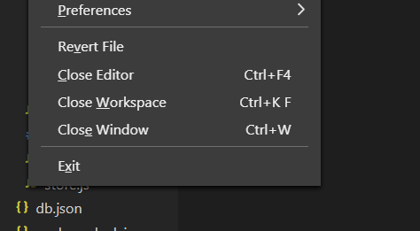

***

# https://learngitbranching.js.org/

***

## Create npm project form vscode only

```bash
open vscode, Goto File> Open Folder> open the directory and create new folder there, and select that folder to open.
Now with terminal in vscode, do npm init -y
You are done.
```

***

## Destructuing the variable as different name:

```js
let { v1: rassu } = {v1:{uuidd:23,mid:24}}
```

***

```js
const { v1: uuid } = require("uuid");
console.log("$uuid()", uuid());
//output $uuid() 59d9cdc0-9049-11ea-87eb-8b2cefafa0ad
```

***

## Css framework:

[Bulma @ github.com](https://github.com/jgthms/bulma)   - 40k stars on github

https://bulma.io/


***

## Date Object

```js
new Date()
// Output(date object): Thu May 07 2020 20:10:06 GMT+0530 (India Standard Time)

new Date().toString()
// Output(string): "Thu May 07 2020 20:09:28 GMT+0530 (India Standard Time)"
```

***

## if else if:

```
if (condition1) {
  //  block of code to be executed if condition1 is true
} else if (condition2) {
  //  block of code to be executed if the condition1 is false and condition2 is true
} else {
  //  block of code to be executed if the condition1 is false and condition2 is false
}
```

***

## includes in array

```
[1,2,3].include(3)
// true
[1,2,3].include(7)
// false
```

***

## Create file with keyboard in vscode:

Press **Ctrl + shift + E** => then press Shift + tab, then press tab once. That's it.

***

## Install tar for windows via npm :

#install tar, #tar for windows, #windows tar, #tar in windows

```
"C:\Program Files\Git\usr\bin"
add the above path in environment variable, to let cmd get access to the tar.exe file which bash.exe uses interally for its own purposes.

*Note: tar can't be installed via:- npm i -g tar #This is something else, although this isn't an executable.
```

***

## Tagged Templated / Tag functions:

```js
let person = 'Mike';
let age = 28;

function myTag(strings, personExp, ageExp) {
  let str0 = strings[0]; // "That "
  let str1 = strings[1]; // " is a "

  // There is technically a string after
  // the final expression (in our example),
  // but it is empty (""), so disregard.
  // let str2 = strings[2];

  let ageStr;
  if (ageExp > 99){
    ageStr = 'centenarian';
  } else {
    ageStr = 'youngster';
  }

  // We can even return a string built using a template literal
  return `${str0}${personExp}${str1}${ageStr}`;
}

let output = myTag`That ${ person } is a ${ age }`;

console.log(output);
// That Mike is a youngster
```

***

## Mocha testing library:

```
npm install -g mocha
```

Then from the root of the project, you can just call 

```
mocha
```

***


## Install ramada.js

```
npm install ramda
```

Import it in node/react, via

```js
const R = require('ramda');
or
import * as R from 'ramda';
```

```js
import only the required functions via import { functionName } from 'ramda';
```

Cook Book - All helpful code snippets at one place - [official_github_wiki_link_itself_in_reposiotry](https://github.com/ramda/ramda/wiki/Cookbook#pick-values-a-from-list-by-indexes)

***

## Press windows button

And then press, Ctrl + Tab (to open the all the installed apps window) and press Ctrl + Tab to switch back to default mode.

***

### Prettier Line Maximum length Setting to fold - maximum limi

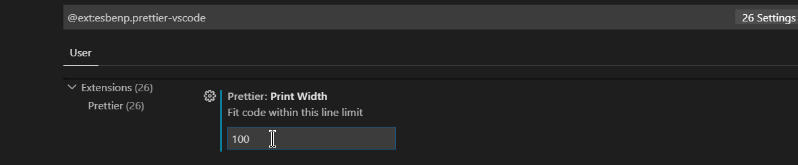

***

## Open Debugging Console in Vscode:

```
Press: Ctrl + Shift + Y
```

***


## Console.log

```js
let foo = 23
let bar = 24
console.warn
console.log(false, 'user is not logged in') // this will come up with an error appearance.
console.log(true, 'user is not logged in')  // this will come up with an verbose appearance.

console.log({foo, bar}) // prints values with name of the variables.
console.log(obj/arrayobj) 
// This is becoz an object can be passed to the console.log directly to output it.
console.table(obj/arrayobj) // prints in a table.
console.trace('who called me') 
// this will show the call stack and the appropritae one on the top of all.
console.count('anything1')
console.count('anything1')
console.count('anything1')
// this will display the counting for each as 1,2,3. for each statement.
```

```js
/ execute all of this to know how grouping works in js console.:
console.log("This is the outer level");
console.group();
console.log("Level 2");
console.group();
console.log("Level 3");
console.warn("More of level 3");
console.groupEnd();
console.log("Back to level 2");
console.groupEnd();
console.log("Back to the outer level");
```

***

## Webpage or Json api fetch:

```js
//fetch is available in browser only
fetch('https://api.github.com/users/github')
    .then(res => res.json())
    .then(json => console.log(json));
//below one is to fetch the html of webpage
fetch('https://npm.runkit.com')
    .then(res => res.text())
    .then(body => console.log(body));
```

As an alternate to fetch, in node you can use package : *node-fetch* and uses the same above mode to get wepage and json with same methods as above(i.e., as fetch behaves in any browser.) You can install it via 

```js
npm i node-fetch
```


_

Similar, axios approach to get html and json from a webpage:-

```js
axios.get("http://api.github.com/users/github").then((res) => console.log(res.data));
//json is received
axios.get("http://www.google.com").then((res) => console.log(res.data)); 
// html webpage is received.
```

***

## Invalid JavaScript identifier as a property name

Destructuring can be used with property names that are not valid JavaScript [identifiers](https://developer.mozilla.org/en-US/docs/Glossary/Identifier) by providing an alternative identifier that is valid.

```js
const foo = { 'fizz-buzz': true };
const { 'fizz-buzz': fizzBuzz } = foo;

console.log(fizzBuzz); // "true"
```

[link](https://developer.mozilla.org/en-US/docs/Web/JavaScript/Reference/Operators/Destructuring_assignment)

***

## Assigning to new variable names	

A property can be unpacked from an object and assigned to a variable with a different name than the object property.

```js
const o = {p: 42, q: true};
const {p: foo, q: bar} = o;
 
console.log(foo); // 42 
console.log(bar); // true
```

***

## Default values in destructuring:-

A variable can be assigned a default, in the case that the value unpacked from the object is `undefined`.

```js
const {a = 10, b = 5} = {a: 3};

console.log(a); // 3
console.log(b); // 5
```

***

## Assignment without declaration

A variable can be assigned its value with destructuring separate from its declaration.

```js
let a, b;

({a, b} = {a: 1, b: 2});
```

***

### Mongodb transactions an other look to look:

[link](https://hackernoon.com/mongodb-transactions-5654cdb8fd24)

***

## Find elements in a common particular tags and double click them with javascript:

```js
var aTags = document.getElementsByTagName("span");
var searchText = "Double-click on this paragraph";
var found;

for (var i = 0; i < aTags.length; i++) {
	console.log(aTags[i].textContent)
    if (aTags[i].textContent == searchText) {
    found = aTags[i];
    break;
  }
}
//Below code is to double click the found element.
var dblclickEvt = document.createEvent("MouseEvents");
dblclickEvt.initEvent("dblclick");
found.dispatchEvent(dblclickEvt);
```

You can test the above code at wepage - w3school-[tryit](https://www.w3schools.com/jquery/tryit.asp?filename=tryjquery_event_dblclick) ; w3school more @ [link](https://www.w3schools.com/jquery/event_dblclick.asp).

Stack overflow [link](https://stackoverflow.com/questions/3813294/how-to-get-element-by-innertext) , [link2](https://stackoverflow.com/questions/11616189/how-to-dispatch-a-double-click-event-on-an-element) 

***

### Know if there are running tasks:

(below image shows two tasks are running.)

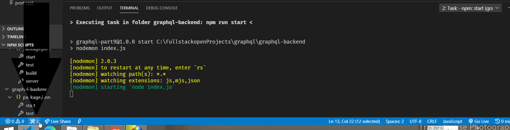***

***

## Hoisting Concept in Javascript

```js
sayName()
function sayName() {
	console.log('Hello there..')
}
var sayAge = function () {
	console.log('My age is 25 oh no')
}
sayAge()
```

The functions works greaty with no error. But the below one blews:

```js
sayName()
sayAge() // blows here..
function sayName() {
	console.log('Hello there..')
}
var sayAge = function () {
	console.log('My age is 25 oh no')
}
```

The error says, --sayAge is not a function--, which is ridiculously wrong as per our understanding, but what we are doing is not semantic( i.e., logically correct according to the language).  So the learning here is that var sayAge is not a function but actually a variable declaration according to the language compiler. To be able to get the benefits of function hoisting in such cases we need to declare them with the older correct way of using functions i.e.,  like we have done with the sayName function in the same program.

***

Below command console, debug console, and other things are contained in panel. You can move the panel like., 

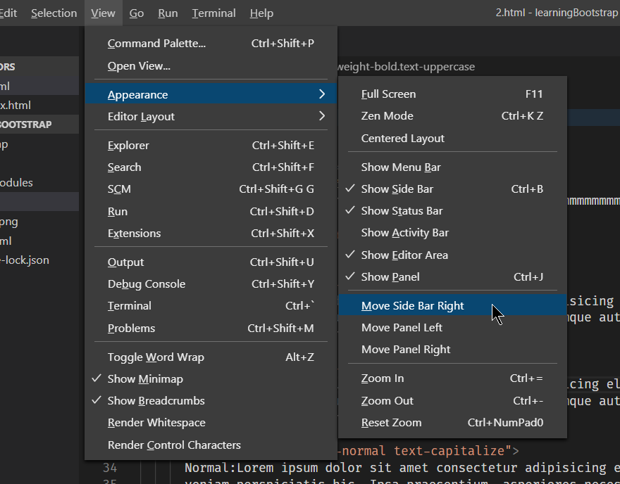

***

The next.js library that [ React Fast Refresh, Incremental Static Regeneration, New Environment Support, Built-in Fetch, and more!](https://nextjs.org/blog/next-9-4).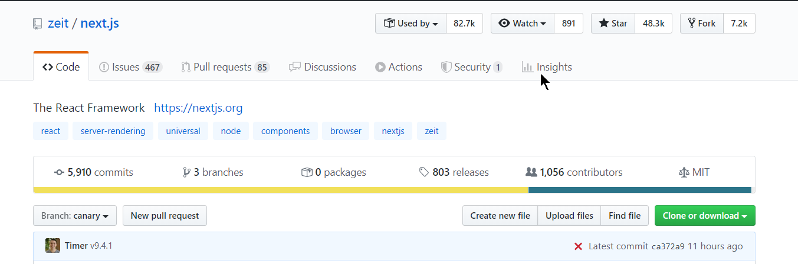

Help link for next.js @ [link](https://www.freecodecamp.org/news/the-next-js-handbook/). Official Documentation: [link](https://nextjs.org/docs). 

***

```
}, [result.data])  // eslint-disable-line 
```


***

Using your **C** key, you can turn captions on or off.

To increase the size of the captions, use the **+ (plus)** key. To decrease the size of the captions, use the **– (minus)** key.

***

### You can get the length of parameters of a function like

```js
(function add(a, b, c) {
  return a + b
}).length
//this will outut 3, bcoz parameters are 3.
```

***

## Adding .env file to webpack:

Help link @ [stackoverflow](https://stackoverflow.com/a/46232148/10012446)

You can use `dotenv` package for this purpose

Reference: https://www.npmjs.com/package/dotenv https://github.com/motdotla/dotenv

At top of webpack config file, require dotenv as follows(set your .env path currectly)

```js
var dotenv = require('dotenv').config({path: __dirname + '/.env'});
```

in webpack config plugins section use

```js
new webpack.DefinePlugin({
            "process.env": dotenv.parsed
        }),
```

Now you can use the env variables throughout your app. try `console.log(process.env);` in you app code

***

To get rid of error: Can't resolve 'fs' while configuring .env file, you may do this...

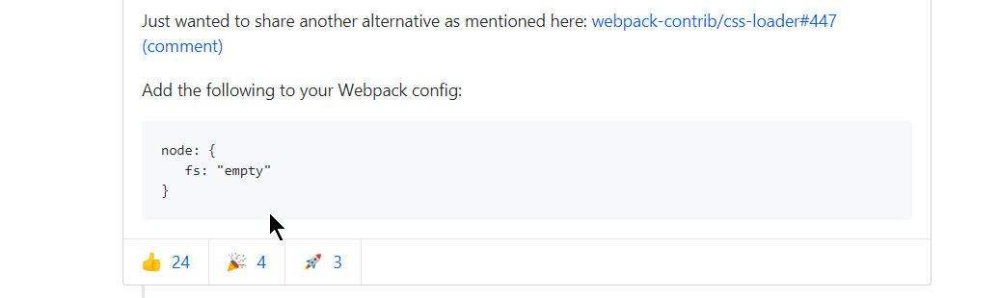

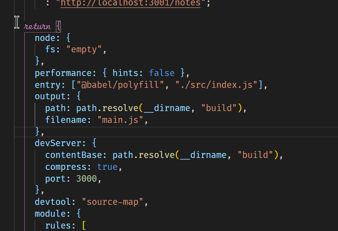

***

## Import path 

```js
const path = require('path'); 
```

***

## Environment Variables in CreateReactApp:

```js
There is also a built-in environment variable called NODE_ENV. You can read it from process.env.NODE_ENV. When you run npm start, it is always equal to 'development', when you run npm test it is always equal to 'test', and when you run npm run build to make a production bundle, it is always equal to 'production'. You cannot override NODE_ENV manually. This prevents developers from accidentally deploying a slow development build to production.
```

***

### Create index.js file inside a folder, and you can run it via just node . command

***

- You can assign data to global object in node

- process.platform will return the window/linux/max on appropriate system.
- process.env.USER will return the user logged in current operating system.

***

## Node program can work in blocking and non-blocking way-

### -	In blocking way-

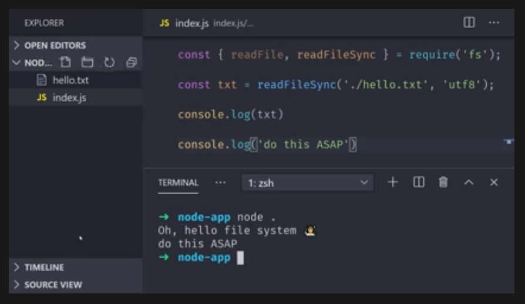

### -	In non-blocking way:-

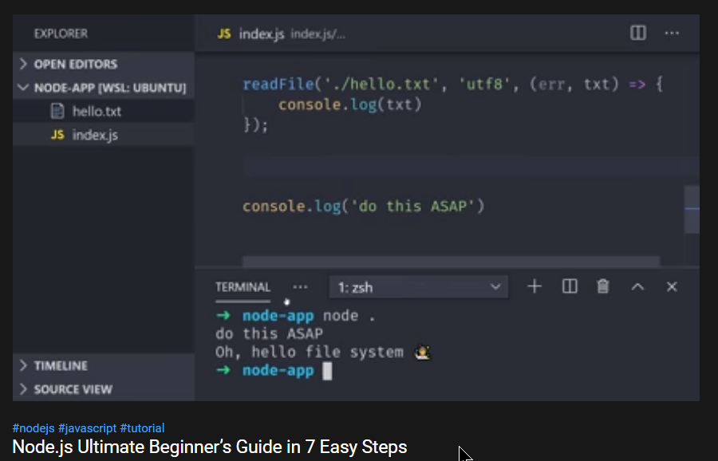

***

## Promises are asynchronous and non-blocking

***

### Top level await

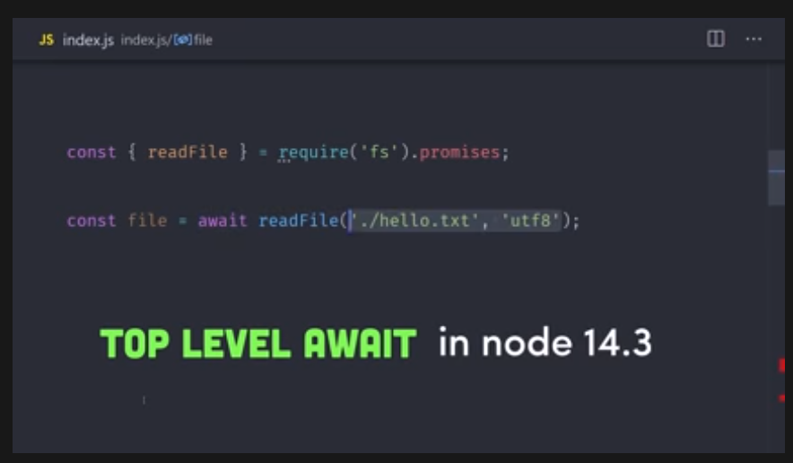

*

#### General way of using await to read the file, using async/await-

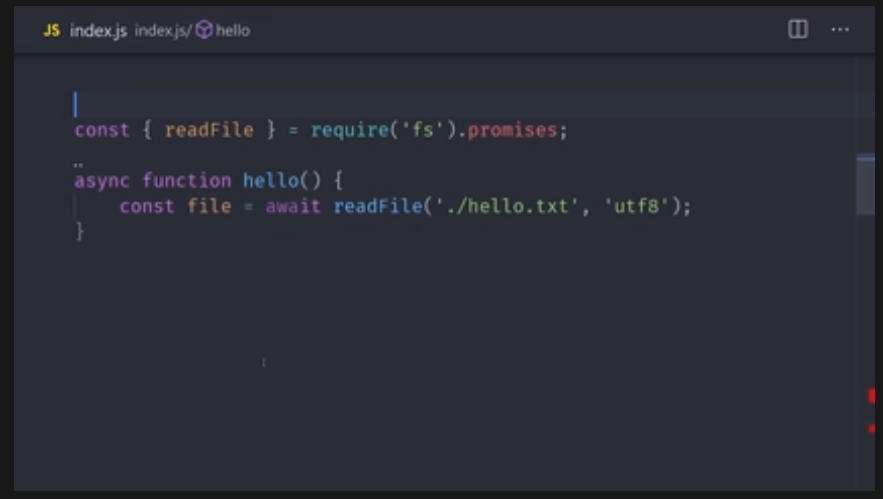

***

## Change new line format 

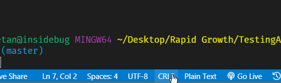

CRLF : CR + LF (windows format)
LF : LF only.

***

## Another syntax for Immediately  invoked function-

```js
(() => {
  console.log("hello...");
})();
//works in node
```

***

### Top level await works in chrome, as v8 has now support for top level await(chrome runs on v8)

official v8 [link](https://v8.dev/features/top-level-await)

```js
await setTimeout(() => console.log("Amazingg...."), 2000)
//works in chrome(v8 engine).

try {
  jQuery = await import('https://cdn-a.example.com/jQuery');
} catch {
  console.log('Hello.., I can execute in chrome, as top level await is supported in v8 now.')
}
```

### Dependency fallbacks

The following example attempts to load a JavaScript library from CDN A, falling back to CDN B if that fails:

```js
let jQuery;
try {
  jQuery = await import('https://cdn-a.example.com/jQuery');
} catch {
  jQuery = await import('https://cdn-b.example.com/jQuery');
}
```

info: [v8](https://flaviocopes.com/v8/) recently introduced top-level `await` for ES modules. It’s a new proposed standard for ECMAScript, which has [reached stage 3](https://github.com/tc39/proposal-top-level-await).

## Isn’t top-level `await` a footgun? [#](https://v8.dev/features/top-level-await#isn't-top-level-await-a-footgun%3F)

[link](https://v8.dev/features/top-level-await#isn%E2%80%99t-top-level-await-a-footgun%3F)

Any feature whose addition to a product results in the user shooting themselves in the foot.

***

### Any gist can be embedded here like this:-

<script src="https://gist.github.com/sahilrajput03/433dfeeafa9cc338cc91e4289422ab07.js"></script>

***

The difference between public and private gist is that, private gists are not crawlable by search engines and not visible on your [gist.github.com/sahilrajput03](gist.github.com/sahilrajput03) profile. You can share private gists with the url with no disadvantage at all.

Any private gist can be turned to public gist easily

***

## To simply view a gist on cli

[link](https://hub.github.com/hub-gist.1.html)

```js
$ hub gist show <file-id(not the url)>
//above command works good, but if you have more than one file, it will show you the names of the files with extension. So you could view one file at a time, with the command below:-
$ hub gist show <file-id(not the url)> OnlyOneFileName.js
```


## You can clone any gist like the repository

### IMORTANT: When you update a gist, its id doen't change. 

```bash
$ git clone <gist-url>
$ git clone <gist-url> . # this would result similar results that with the git-repository.
# You need to have the current directory with no content, you could create a new directory with mkdir and use that too.
e.g., 
$ git clone https://gist.github.com/vkarpov15/dbac89019245b10b7fb78d3530a1fed3
```

***

```bash
$ node .
# Above command just executes index.js file in current folder.
```

***

```js
const fetch = require('node-fetch')

fetch('https://jsonplaceholder.typicode.com/posts/1')
  .then(res => res.json())
  .then(data => console.log(data) )

```

***

## Important when tried to load a url via import in node experimental or node current edition-

It throws this:

```
import ss from "https://stackpath.bootstrapcdn.com/bootstrap/4.5.0/css/bootstrap.min.css";
=>
Error [ERR_UNSUPPORTED_ESM_URL_SCHEME]: Only file and data URLs are supported by the default ESM loader
```

help @ [stackoverflow](https://stackoverflow.com/questions/34607252/es6-import-module-from-url)

***

### Let say a gist has a single file - temp.js

At url : https://gist.github.com/sahilrajput03/e9dc0c6c58e403a1218fdfa81b887c22
So, the latest raw file can be accessed by the below permalinks:-

- https://gist.githubusercontent.com/sahilrajput03/e9dc0c6c58e403a1218fdfa81b887c22/raw/temp.js
- https://gist.githubusercontent.com/sahilrajput03/e9dc0c6c58e403a1218fdfa81b887c22/raw/

***

### Let say a gist has multiple files - class.js, file2.js, nodemon2.js

At url : https://gist.github.com/sahilrajput03/28c54304104b1acdbf5c51271cc4105a
So, the latest raw file can be accessed by the below permalinks:-

IT TAKES APPROXIMATELY 4 MINUTES TO GET THEM UPDATED ACTUALLY, while you can always switch to the raw commit specific version by getting it manually by visiting the gist and clicking the raw button. You can get the raw commit specific version of all the files in the gist individually.:D

- ​	https://gist.githubusercontent.com/sahilrajput03/28c54304104b1acdbf5c51271cc4105a/raw
- https://gist.githubusercontent.com/sahilrajput03/28c54304104b1acdbf5c51271cc4105a/raw/class.js
- https://gist.githubusercontent.com/sahilrajput03/28c54304104b1acdbf5c51271cc4105a/raw/file2.js
- https://gist.githubusercontent.com/sahilrajput03/28c54304104b1acdbf5c51271cc4105a/raw/nodemon2.js
- NOTE: with the parameter:- raw, only the first file added in the gist will be fetched, so its good to define fileName when multiple files are used in the gist.

***

You can get the commit specific raw file as soon as you create them, by some mechanism to get the url by looking at the schema they use to build that raw file's url. Its easy and can be done by some node's mechanisms. PRETTY Challenge. 

***

## Error lens Setting-

```js
"errorLens.exclude": [
  "File is a CommonJS module; it may be converted to an ES6 module.",
  " is declared but its value is never read"
]
```

***

## Exec example:

[link](https://nodejs.org/api/child_process.html#child_process_child_process_exec_command_options_callback)

```js
const util = require('util');
const exec = util.promisify(require('child_process').exec);

async function lsExample() {
  const { stdout, stderr } = await exec('ls');
  console.log('stdout:', stdout);
  console.error('stderr:', stderr);
}
lsExample();
```

***

## wget

Download wget from https://eternallybored.org/misc/wget/ and place it in c:\personalExecutables and add this path to the environment's path. # download curl, install curl, curl install, curl download

```
wget <url>
doing this multiple times, will create addiotional copies like.
file.js
file.js.1
file.js.2
file.js.3
***
So, workaround this is to overwrite the original file i.e.,
wget <url> -o <desiredFileName>
```

***

### Maximise Panel in vscode-

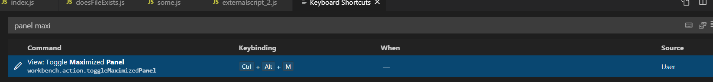

```js
{
  "key": "ctrl+alt+m",
  "command": "workbench.action.toggleMaximizedPanel"
}
```

***

Event Emitter Code @ repo - TestingArenJSNodemon.

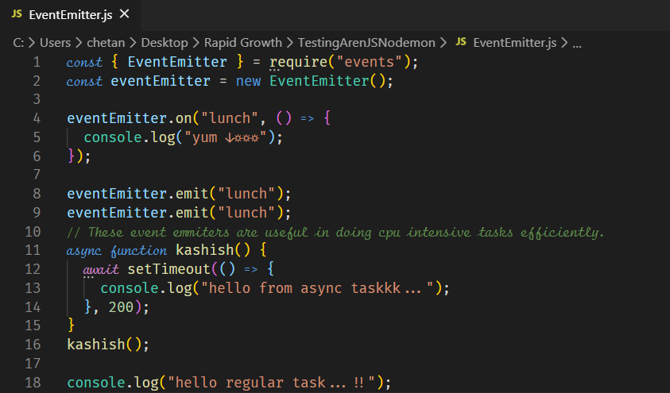

***

## Nodejs documentations for LTS:-

https://nodejs.org/dist/latest-v12.x/docs/api/

***

## Setting indentation to 2 spaces

By default it is 4 spaces in vscode. But 2 is recommended.(Prettier uses 2 too, and then vscode detects).

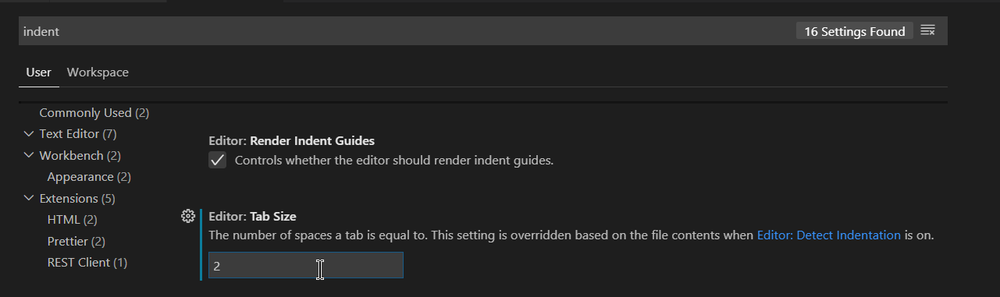

***

## Single quotes, double quotes, and backticks

- ARticle @ medium- [link](https://medium.com/javascript-in-plain-english/the-real-difference-between-single-quotes-and-double-quotes-in-javascript-3d00bf720bcd)
- Multiline strings with backticks

```
sst = `sahil\nRajput`
//Output : "sahil
Rajput"
```

- ```
  const webAwareAI = `<div class="cloud">
  <h1>Loading consciousness... It's loading...</h1>
  </div>`
  console.log(webAwareAI)
  
  /**
   *  Output:
   *  <div class="cloud">
   *  <h1>Loading consciousness... It's loading...</h1>
   *  </div>
   */
  ```

  -Backtick literals are [**just as fast** as other string literals](https://medium.com/javascript-in-plain-english/are-backticks-slower-than-other-strings-in-javascript-ce4abf9b9fa), whether or not you [compile them using Babel](https://medium.com/coding-at-dawn/does-compiling-javascript-code-using-babel-make-backtick-literals-as-fast-as-regular-quotes-cd1f29906691). So why not use backticks ```` instead? 😊

  # Don’t forget about JSON

  JavaScript Object Notation [(JSON](https://www.json.org/)), the lightweight data storage format, only allows double quotes.

  If I happen to be copying back-and-forth from JavaScript to JSON files, using just double quotes helps me stay consistent.

  This is pretty rare — I just try to remember to not use single quotes in JSON.

  When handling JSON files from within JavaScript, the [stringify() and parse()](https://medium.com/javascript-in-plain-english/how-to-use-stringify-and-parse-in-javascript-6b637b571a32) functions know about the double quotes already:

  ```js
  const greetings = JSON.stringify({hello: 'World!'})
  console.log(greetings) // {"hello":"World!"}
  console.log(JSON.parse(greetings)) // Object { hello: "World!" }
  JSON.parse({'hello':'World!'}) // SyntaxError: JSON.parse: unexpected character at line 1 column 2 of the JSON data
  view rawcareful-single-quotes-break-JSON.js hosted with ❤ by GitHub
  ```

  It comes down to personal preference, though many people lobby for picking one and using it consistently when creating JavaScript strings.

  For example, [Airbnb’s style guide](https://github.com/airbnb/javascript#strings--quotes) prefers single quotes (‘ ’), avoids double quotes (“ ”), and uses backtick literals (` `) sparingly.

  If anything, we should consistently pick backtick literals (` `) for their advantages around interpolation and multi-line strings.

  ***

  ### Immediately Invoked Function-

  ```js
  (function() {
    alert("I am an IIFE!");
  }());
  
  // Variation 2
  (function() {
    alert("I am an IIFE, too!");
  })();
  ```

  ```js
  (function IIFE_initGame() {
      // Private variables that no one has access to outside this IIFE
      var lives;
      var weapons;
      
      init();
  
      // Private function that no one has access to outside this IIFE
      function init() {
          lives = 5;
          weapons = 10;
      }
  }());
  ```

  ## IIFEs with a return value

  If you don’t need a return value from an IIFE, then you could always use the first stylistic IIFE variation that we saw with unary operators like ***!\***, ***+\***, ***void\***, and etc.

  ```
  var result = (function() {
      return "From IIFE";
  }());
  
  alert(result); // alerts "From IIFE"
  ```

  ## IIFEs with parameters

  Not only IIFEs can return values, but IIFEs can also take arguments while they are invoked. Let’s see a quick example.

  ```js
  (function IIFE(msg, times) {
      for (var i = 1; i <= times; i++) {
          console.log(msg);
      }
  }("Hello!", 5));
  ```

  ## When you can omit parentheses

  Parentheses around the function expression basically force the function to become an expression instead of a statement.

  But when it’s obvious to the JavaScript engine that it’s a function expression, we don’t technically need those surrounding parentheses as shown below.

  ```js
  var result = function() {
      return "From IIFE!";
  }();
  ```

  ***

  **Use camelcase when naming variables and functions.**

  ```js
    function my_function () { }    // ✗ avoid
    function myFunction () { }     // ✓ ok
   
    var my_var = 'hello'           // ✗ avoid
    var myVar = 'hello'            // ✓ ok
  ```

  ***

***

## JavaScript Standard Style

https://standardjs.com/rules.html#javascript-standard-style

***

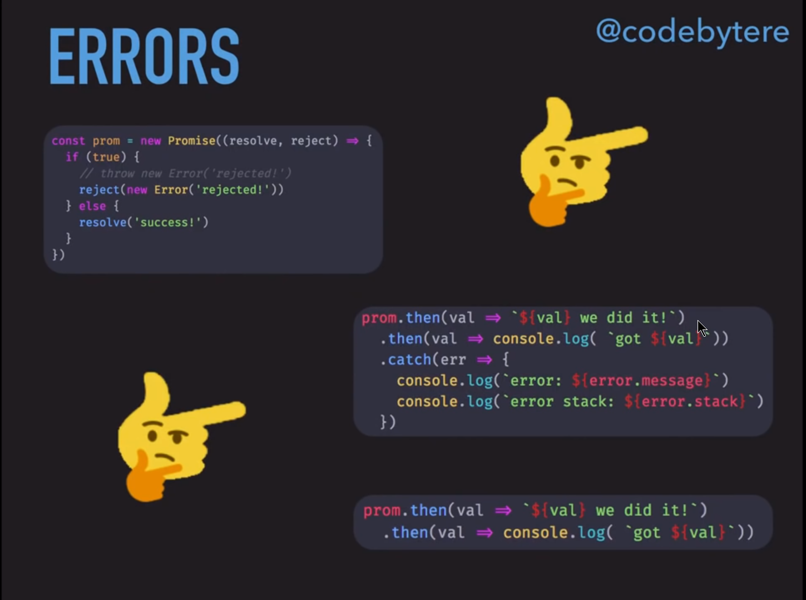

***

### Printing deep inside codes generated by node(or v8)

Deoptimization - This is actually the reverse of optimization, but why would anybody would do that, because under the hood languages uses some tricks to save space and perform better. And the key is to undo those things in times when they actually are causeing no benefits. Do not ever try to get opt-code or byte-code with some flags of chrome, they are too lengthy to read.

***

https://immutable-js.github.io/immutable-js/

https://github.com/immutable-js/immutable-js

***

https://observablehq.com/@sahilrajput03, 

***

## Saving workspace with **Ctrl+Shift+P**

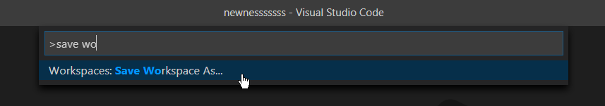

***

This annoying thing only shows up when you run scripts via NPM SCRIPTS from vscode's Toolbar. So, better use:-
npm run dev, npm statt, etc, directly in console.

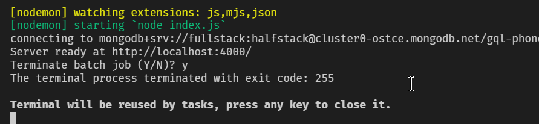

***

## Options for taks

Press Ctrl+shift+P and enter configure task, this will generate the task for the appropriate script you select from the available list in the package.json file of the project.

[link](https://vshaxe.github.io/vscode-extern/vscode/TaskPresentationOptions.html), You probably need the settings as -

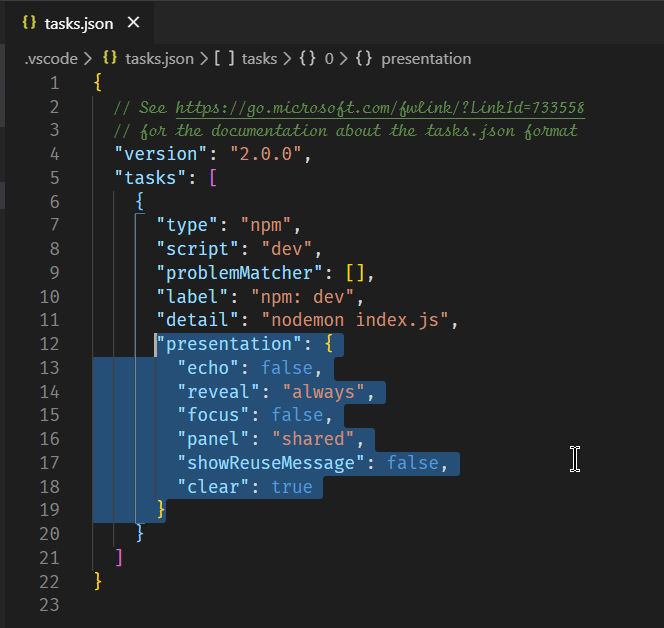

as taks.json file is in -

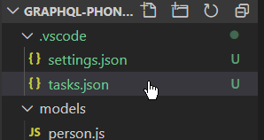

Check out this official guide from vscode @ [link](https://code.visualstudio.com/docs/editor/tasks)

***

## To install a dependency as development dependency, use the -D option(it is case sensitive)#get rid of terminate batch job (Y/N)? This is for command prompt only, minnty doesn't ask for such thing.

Also this won't cause any sideeffect in mintty or ubuntu.

==**tbj**== stands for **T**erminate **B**atch **J**ob (Getting rid of this..)

```bash
$ npm i -D tbj
#Above dependecy will help you close nodemon or node with simple ctrl+c only, and will not prompt for yes/no to exit. Amazing though.
#To work with this, you need to preceed the existing commands with tbj keyword.
*This dependency requires you to install nodemon as a dependecy in your current project. So that\'s a downside but still amazing, no other solution to this problem though(Its licensed by MIT).
```

Helpful [link - dependecy page@npmjs.org](https://www.npmjs.com/package/tbj?activeTab=readme).

***

## Clearing Terminal in vscode-

Note the **when**  as ==terminalFocustext==. Clear terminal vscode, vscode clear terminal, console clear vscode, clean console, clear terminal vscode, vscode clear terminal, 

This relief, as when you want to log something new in the terminal you won't get confused howsoever after setting this..


***


Shitt!!

***

### Trying to add wildcards to freenom.ml - Failed

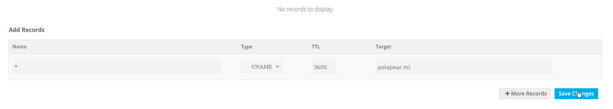

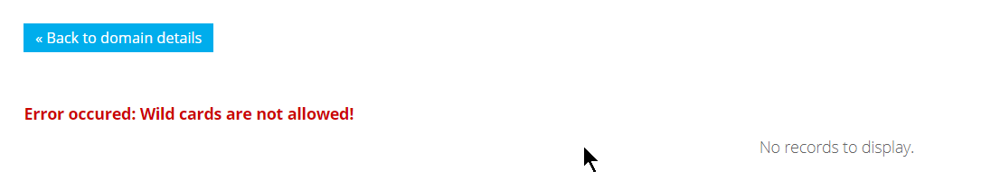

***

## Expres Generator

Official at [expressjs.com](https://expressjs.com/en/starter/generator.html)

```bash
$ npm install -g express-generator
$ express --view=pug myapp #this creates myapp project.
```

Bakwaas.

***

https://michalsnik.github.io/aos/

https://aleri.ca/ developed by Nirmal Patel

***

On your laptop or tablet, hybrid sleep is disabled by default becuase you have a battery failsafe. If your battery no longer works and you have to keep your laptop plugged in at all times, you can enable hybrid sleep on via this option  -

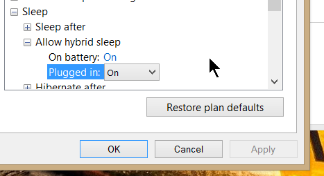

Actually this feature will work like hibernate if power is lost during sleep. Otherwise it would have abruptly result in power failure crash of the system.

***

## nvm

```bash
# ****USE POWER SHELL TO ALL THESE COMMANDS**********:-

# I am Currently using version of node 12.18.0 64bit vesion.
# LEARN: nvm install syntax -> e.g. <node-version> <system architecture-32/64>
nvm install 12.18.0 64 ## This will install - Node 12.18.0 64bit version.
nvm install 12.16.2 64 # This will install - Node 12.16.2 64bit version.
nvm install nvm use 12.16.2 64 # Will do similarly.
nvm uninstall 12.16.2 64 # This will undo tha, LOL, don't do it, you may need it some years later.


nvm list ## This will show you all the installed versions of node, you installed via `npm install ...` 
nvm off # This will just turn off nvm.
nvm on # This will just turn it on again.

nvm use 12.18.0 64 ## You can activate a different vesion of installed node via this command.

#From npm -h, below also seems to work!!
nvm install latest 64 
nvm install latest #By deafult system architecture(so specifying 64 is optional I guess) is used for the node too.
```

***

Isn't this amazing1!! I got this software for free. Isn't this awesome.!!

>>??what do you say??
>>
>>*

***

## Setting desired titlebar design in vscode

```json
"window.title": "${dirty}${rootName}${separator}${activeEditorShort}"
```

$dirty -> this is like, a white dot is shown in front of the file name, and you'll save it, then only it'll get off.

src- https://stackoverflow.com/questions/38483687/showing-project-folder-in-title-bar-for-visual-studio-code

***


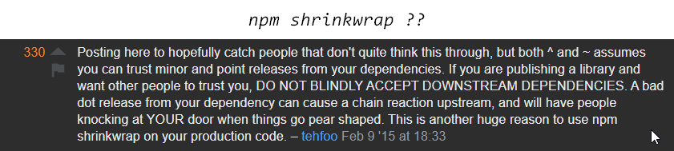

***

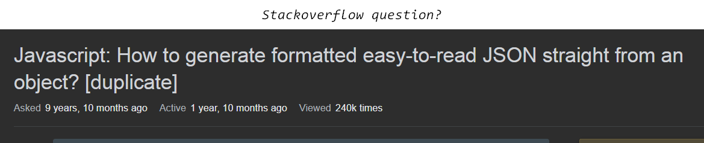

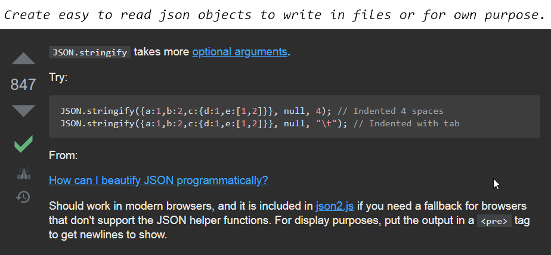

***

