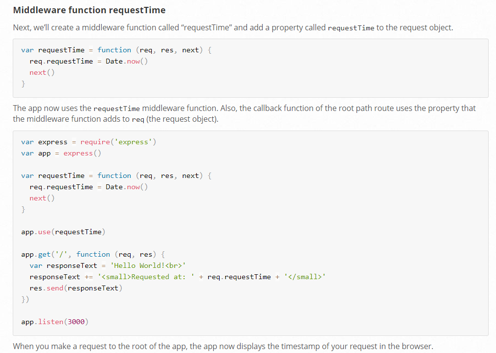

## Creating requestTime middleware

src: [@Express Docs](https://expressjs.com/en/guide/writing-middleware.html)



## Mounting sub express in exress app

```bash
var express = require('express')

var app = express() // the main app
var admin = express() // the sub app

admin.get('/', function (req, res) {
  console.log(admin.mountpath) // /admin
  res.send('Admin Homepage')
})

app.use('/admin', admin) // mount the sub app
```

express docs - [link](https://expressjs.com/en/4x/api.html#req.body)

***

## Different key-value properties of request:

[link](https://expressjs.com/en/4x/api.html#req) - express amaz documentation.

***

