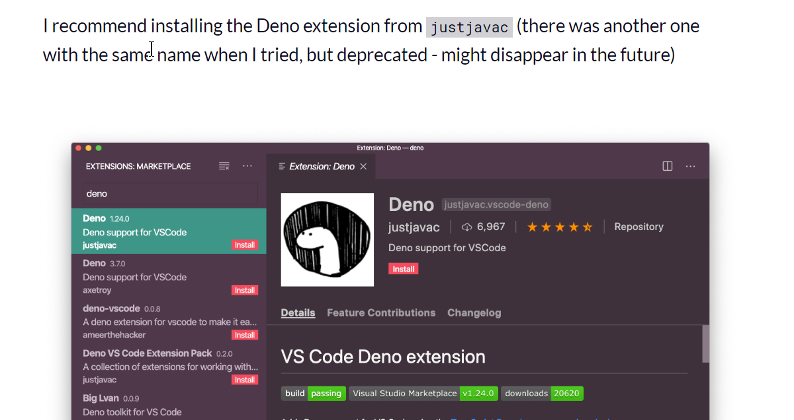
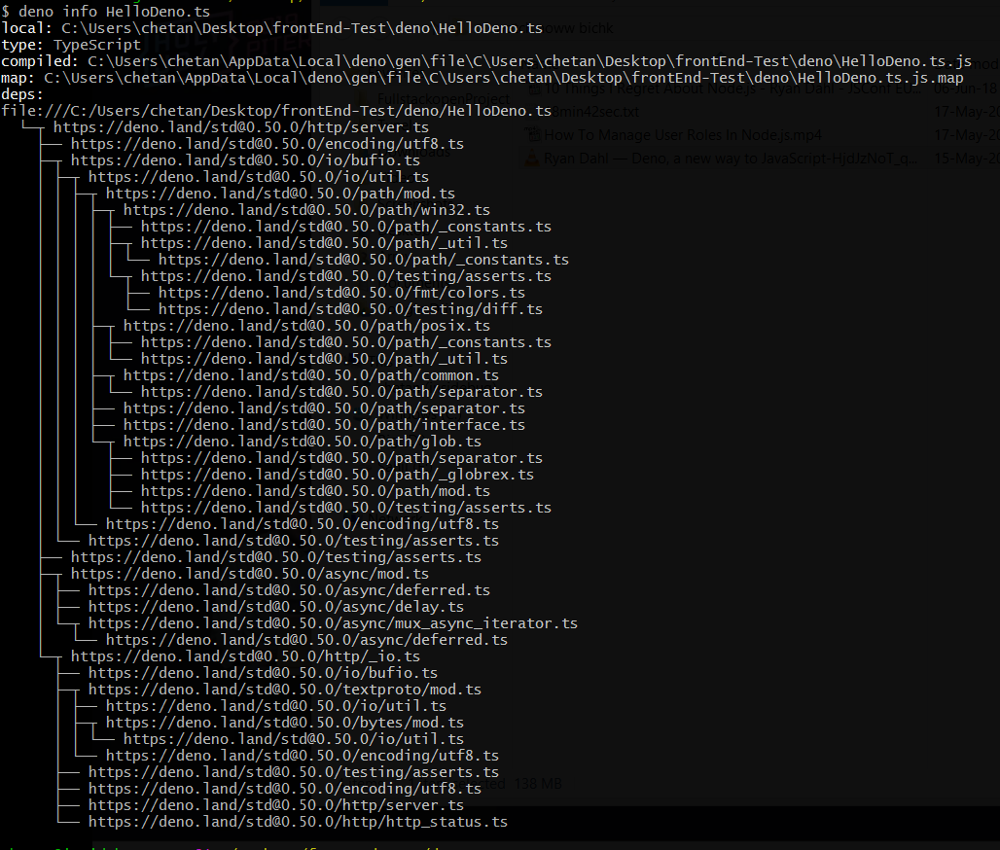
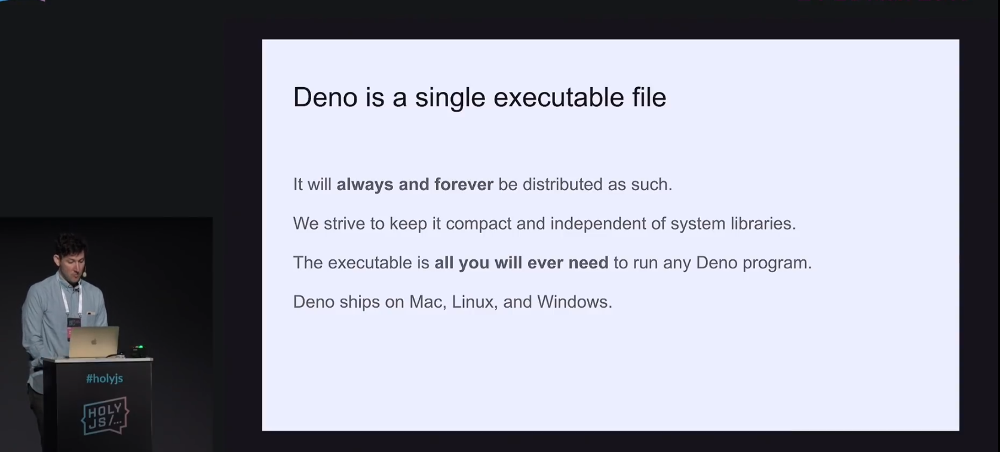

# Welcome to deno's home

***

### Deno Handbook Goodone:

@[freecodecamp.org](https://www.freecodecamp.org/news/the-deno-handbook/)

***

### Install the extension:



***

```
$ deno run --allow-net --allow-read http://deno.land/std/http/file_server.ts
$ deno run -A <file/url.ts>
both commands run fine, below one gives all needed permissions to the program automatically.
```


***

```
deno info <any file/ program's url>
# above command will show the dependency tree of the dependencies included and other general information.
```



***

```bash
deno fmt <any js or ts file>
#This command will run prettier on the file.
#JavaScript programmers are used to running Prettier, and deno fmt actually runs that under the hood.
```


***

Get and post request with deno program

@article @ [medium](https://medium.com/@kushalbhalaik/getting-started-with-deno-ee8859b1b716)

Run the below fine as 

```
deno run <this file>
```

```
import { Application, Router } from "https://deno.land/x/oak/mod.ts";
const router = new Router();
router.get("/", context => {
  context.response.body = "Hello World!";
});
router.post("/", context => {
  context.response.body = "You have made a POST request!";
});
const app = new Application();
app.use(router.routes());
app.use(router.allowedMethods());
const server = app.listen({ port: 5000 });
console.log("Listening on http://localhost:5000/");
```

***

```
deno -A index.ts
```

'	-A flag provides all the necessary permission for your app to run on your machine*

***

### Caching Design:

User Device > Edge Caching System > -------> Databse Caching System > Database
More than 80% of the service, energy costs go to the caching systems. Thats where all of the resources go.
P99 == 99th percentile of the latency. All big companies want P99 to be below 100ms, but they don't achieve it at all anywhere. 

-

Latency is a synonym for delay. In [telecommunications](https://searchnetworking.techtarget.com/definition/telecommunications-telecom), **low latency is associated with a positive user experience** (UX) while **high latency is associated with poor UX**.

***

The JavaScript APIs that we have invented to interact with the operating system are all found inside the "Deno" namespace (e.g. `Deno.open()`). These have been carefully examined and we will not be making backwards incompatible changes to them.

***

### Program

```
$ deno run --allow-net HelloDeno.ts
```

```js
//HelloDeno.ts file
import { serve } from "https://deno.land/std@0.50.0/http/server.ts";
const s = serve({ port: 8000 });
console.log("http://localhost:8000/");
for await (const req of s) {
  req.respond({ body: "Hello World\n" });
}
```


***

### Hello world program

```js
deno run https://deno.land/std/examples/welcome.ts
```


***

### Installing

```
choco install deno
or
iwr https://deno.land/x/install/install.ps1 -useb | iex
(powershell)
```


***

[](https://doc.deno.land/https/deno.land/std/fs/mod.ts)

A must read article on wikipedia @ [link](https://en.wikipedia.org/wiki/Deno_(software)) . Lists all general things you need to know.

***

Rust : A must checkout language, all you need to learn and know(there are videos too) @ [MDN](https://developer.mozilla.org/en-US/docs/Mozilla/Rust).
DENO is build with rust. (earlier it was written in go, but got problems with it.)

***

From the video "10 Things I Regret About Node.js - Ryan Dahl - JSConf EU", 

- When you specify the any url anywhere inside the files, deno will fetch out the code from the url and saves it somewhere, and never downloads it again from the website. If you ever want to refresh the resource form the url, you can specify --reload switch along with the command to execute the with deno. This is similar to Ctrl+F5 in the browser to refresh the resources from the website. Hell YEAH!!.

***

