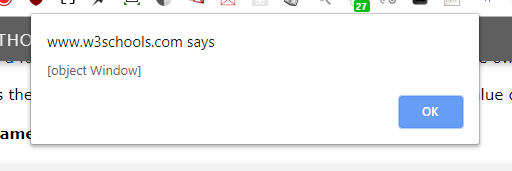
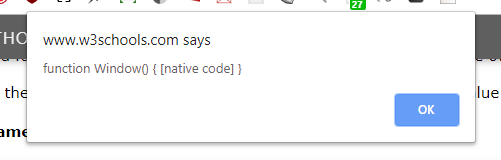

### Javascript ES6 - Rules

```html
<button class="button" onclick="window.location.href = 'https://w3docs.com';">w3docs.com</button> // current tab

<button class="button" onclick="window.open() = 'https://w3docs.com';">w3docs.com</button> // new tab
```

###### * Prints current page via JS - 

`window.print();` 

###### * Also you would like to work with them too.

Old JavaScript examples may use a type attribute: <script type="text/javascript">.
The type attribute is not required. JavaScript is the default scripting language in HTML.

###### * Where to place the script - [StackOverflow](https://stackoverflow.com/questions/38407962/when-to-use-the-script-tag-in-the-head-and-body-section-of-a-html-page?noredirect=1&lq=1) 

***

###### * alert function invokation -

```javascript
alert("I am a alert.")
```

 

OR if address is 127.0.0.1 then it wud be-

 

***

```javascript
 <script>
        document.onkeydown = function (e) { 
            let amla = document.getElementById("rohitkadad");
            if (e.keyCode == 49) {

                amla.click();
            }
        };
        alert("coca-cola");
    </script>
    
<a id="rohitkadad" href="///www.google.com">Bubaa</a>
```

above code will open mouse click / enter key on the element. 

But the code below will not -

```javascript
 <script>
            let amla = document.getElementById("rohitkadad"); //statement-1
/* the code will be executed in the order it is found in the html document. So, statement-1 can't find the element with a id "rohitkadad", thus amla is not retured null value. So code will not work properly. ONE alternate solution to make this code work is to place the element with the id "rohitkadad" above the <script> so the statement can find the define element with the id. 
*/
        	document.onkeydown = function (e) {
            if (e.keyCode == 49) {

                amla.click();
            }
        };
        alert("coca-cola");
    </script>
    
    <a id="rohitkadad" href="///www.google.com">Bubaa</a>
```

***

```javascript
var myObject = {
  	fullName: function () {
	alert(this)
    return this;
  }
}
myObject.fullName();
```


  

***

```javascript
alert(window);
```



***

```javascript
alert(Window);
```



***

###### JavaScript Popup Boxes -

```javascript
window.alert("I'm Alert Box.");
window.confirm("I'm Confirm Box.");
window.prompt("I'm Prompt Box.\nPlease enter your name","Harry Potter(By Default)");
alert("Hello\nHow are you?");
```

 

 

 

 For more check at w3Schools.com 

***

