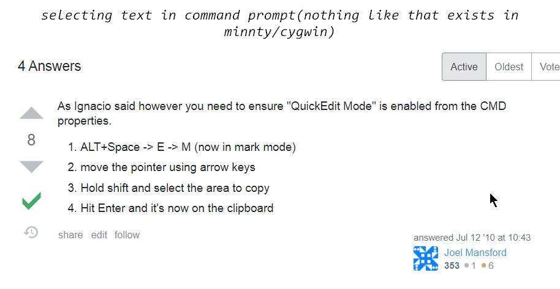
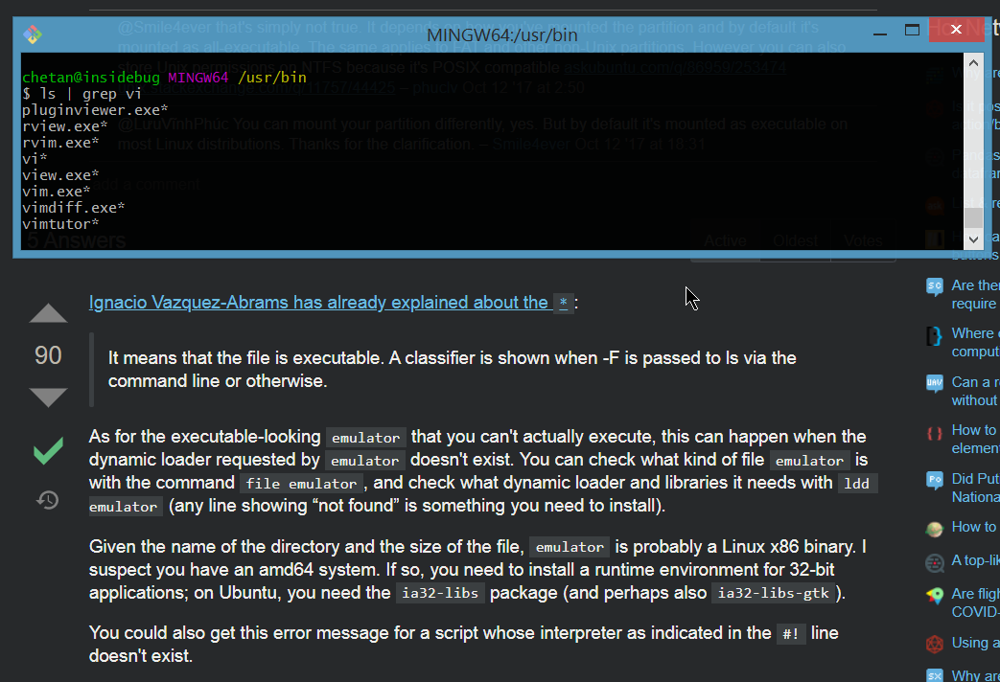
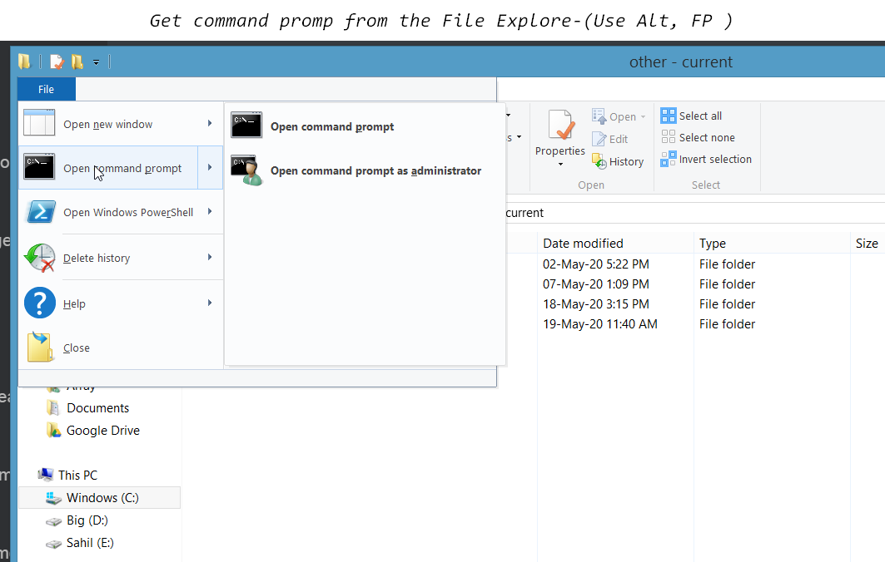
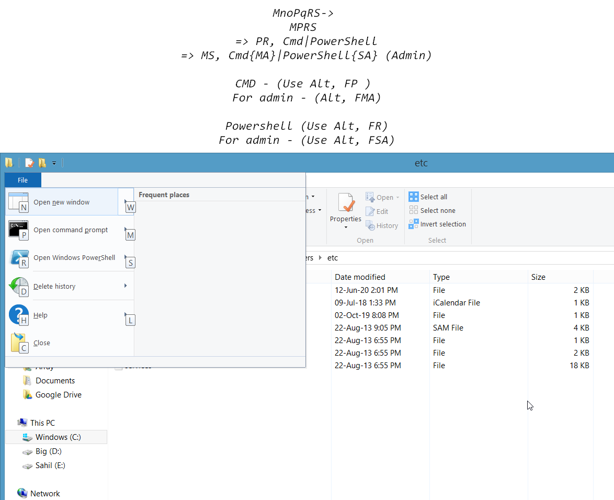
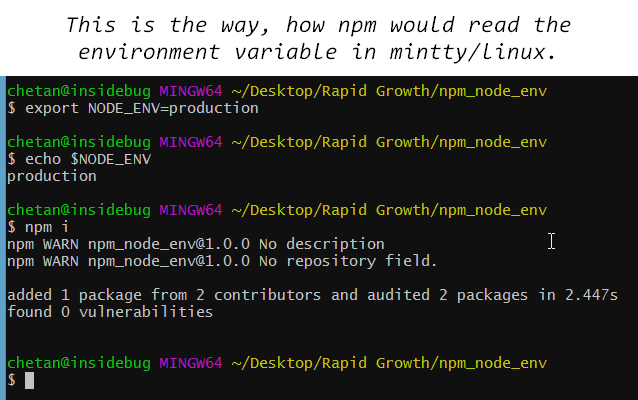
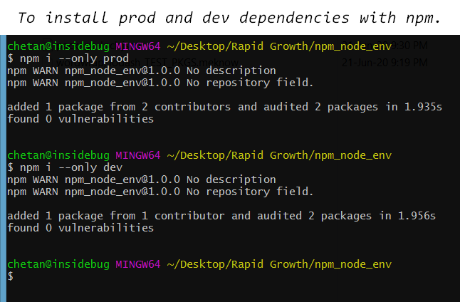

## using ctrl+[shift]+tab

This helps in swithching windows only in between opened mintty windows.

### Scrolling in mintty

You can scroll window of mintty via **up/down** arror or **pgup/pgdown** ==while holdingshift key==.

***

### Creating a file with content with only one command

```bash
echo "this is a git diff test example" > diff_test.txt
echo "this is a diff example" > diff_test.txt #This is adding more content to the file.
```


***

## Creating aliases for mintty-

Also,

```bash
$ e .
::The command is ok.
```

NOTE: to open any folder via argument, you must remove the last slash thats appended automatically via autocomplete.

```bash
$ e GitHub\ Repos/
# Above will not work.
$ e GitHub\ Repos
# This works good though.
```


```bash
Create file in ~ directory in mintty:
(Below alias will work with parameters too)
$ vi ~/.bashrc
And add the line:- alias e='/c/Windows/explorer'

Also, you can temporarily test the alias in a mintty session via-
$ alias e='/c/Windows/explorer'
$ type explorer
Output=> explorer is /c/Windows/explorer
_
Other examples for making aliases-
$ alias less='/bin/less -r'
$ alias ls='/bin/ls -F --color=tty --show-control-chars'

FYI:
File containing .bash_history
•C:\Users\chetan\.bash_history
vi /c/users/chetan/.bash_history
cat /c/users/chetan/.bash_history
```

src: [link](https://www.cygwin.com/cygwin-ug-net/setup-files.html)

***

## What does the * signify after file names in mintty-



***

## Open cmd promp from windows using File explorer menu






***

## curl, wget, grep, vi all for windows

```tx
You just need one cli package manager for windows, and chocolatey is the most idea one. https://chocolatey.org/install , after that.
1. curl: choco install curl
2. wget: https://eternallybored.org/misc/wget/ (Download recent one according to 32/64 bit) and paste the executable in C:\Windows\system32 and its up now.
3. grep: choco install grep 
OR(recommended) You can add the path C:\Program Files\Git\usr\bin to the environments path to get access to the grep utility for the command prompt.(Actually, its made for mintty, the default shell that gets installed when we install git in windows)
4. vi: adding C:\Program Files\Git\usr\bin to the environments path, will enable you to use the vi from command prompt too.

5. querying with && works good with windows though, can you some example what you tried?
```

OP meaning in stackoverflow-


***

## Some debugging about windows batch file and programming 

```
https://en.wikipedia.org/wiki/Batch_file
*
exit will simply exit the program, you should better use exit with the && opertaor.
|| and && acts as the same way as they do in javascript.
I mean that || will execute the right thing only if the left is false,
and && will execute the right thing only if the left is true.

set folder=magic && ECHO someMessage
set folder=magic || ECHO someMessage

Above both commands doesn't work.
**
But appending set command with || or && works as expected.
**
echo %folder% && dir 
Above command will execute dir even if the folder is variable is set or not.
**
:: This is a simple comment. Below program is for practice if block
cd ccd && set folder=cc
if %folder%==cc dir
@pause
**
Below command will execute ECHO irrespective if there are any html files
del *.html && echo YIPEE DELETED.. && @PAUSE
**
Below command will execute @PAUSE only copy is done
copy some.html some.thml || @PAUSE
**
Example if command in batch programming.
if %folder%==sahilrajput03 copy index.html index.htlm 
**
Belo command will supress the output(src: https://stackoverflow.com/questions/617182/how-can-i-suppress-all-output-from-a-command-using-bash)
node nodescript.js >nul 2>nul
**
beLOW command is as effective way to check any error, like to find if its executing or not at all.
ECHO PAUSE28 && @PAUSE
**
Below command throws error always so you need to append || inorder to execute any following command in the current line.
#Although, it throws error program doesn't exit at all.
rmdir /q /s . || echo FULL FOLDER && @pause
**
```


***

## Keeping cmd prompt open while running a file as script from the command line


***

## Killing multiple taks via cmd-

```BASH
$ Taskkill /PID 10204 /F 
#/F TELLS ABOUT THE FORCE TERMINATION OF TASK.
$ Taskkill /PID 10204 /PID 10228 /PID 10256 /F
#ALL PROCESSES WIL BE TERMINATED FORCEFULLY.
```


***

## cmd vs mintty(unix/linux)

## cmd

```bash
# CMD: 
$ where <command-name/executable> 
$ where where
#Output=> C:\Windows\System32\where.exe
$ where ls
#Output=> C:\Program Files (x86)\GnuWin32\bin\ls.exe
$ echo %variable-name%
$ echo %path%
$ echo %username%
#Output=> chetan
$ echo %temp%
#Output=> C:\Users\chetan\AppData\Local\Temp
**
set message=Hello World 
set poco=Amoeba
echo %poco%
```


```bash

# UNIX/MINTTY: 
$ type <command/executable>
#This command finds the path of the executable.(Though this command works as cat in windows).
_
echo $varname

# Winodows uses first match from paths
$ npm config get prefix
This command gets the default directory for global packages for npm.

# Below commands set value for environment variables in linux/mintty.
$ export NAME=VALUE
$ export JAVA_HOME=/opt/openjdk11
*
# Below commands print the value of environment variables in linux/mintty.
$ echo $NAME
$ echo $JAVA_HOME
*
# Below commands will unset (remove) the environment variable in linux/mintty.
$ unset NAME
$ unset JAVA_HOME

### 
```

src: [link](https://www.serverlab.ca/tutorials/linux/administration-linux/how-to-set-environment-variables-in-linux/)

```bash
$ npm i
#this command first checks if the NODE_ENV is set to production or not, if yes it'll behave to install only production dependencies otherwise it'll install both prod and dev dependencies.
```

src: [link](https://docs.npmjs.com/cli/install#:~:text=npm%20install%20(in%20package%20directory,directory)%20as%20a%20global%20package.)



```bash
$ npm i --only prod
$ npm i --only dev
```



### Hibernate with cmd

```bash
$ shutdown /h
```

***

## whoami and hostname


***

## Making a background script 

[Running script in background with vbs script, and make shortcut in startup folder to make it a service.](https://www.winhelponline.com/blog/run-bat-files-invisibly-without-displaying-command-prompt/)

Make a program, as ==program.vbs== and replace the bat file path with your one, and create its shortcut in the **startup** folder.(shell:startup)

```bash
Set WshShell = CreateObject("WScript.Shell") 
WshShell.Run chr(34) & "C:\Batch Files\syncfiles.bat" & Chr(34), 0
Set WshShell = Nothing
```

*

Also, you can check if it is runnning like this-


And you can end the process by ending both the cmd and node process from the same diaglog box, you should select both (otherwise the node will keep running the older processes too)easily with no hassel.

***

## Hibernate pc via cmd

```bash
$ shutdown /h
```


***

## Make a bat file to delete temp files

```bash
cd %temp%
rmdir /q /s .
#@pause'
###
#Also below command will delete .git folder in curretn directory
rmdir /q /s .git

```

Save the file as DeleteTemp.bat

***

### Use Ctrl + p to go to previous and Ctrl + n to go to next command in bash. Use Ctrl + w to delete word to the left.

***

## Favourable window size setting in mintty/git-bash


***

## Copying in git-bash(mintty) and cmd-

- You can **copy** something in git-bash via just selecting something and pressing **c**. [no sideeffect] and paste something with **ctrl+shift+v** or **right-mouse-click**.

- You can **copy**/**paste** something in cmd via just selecting something and pressing **righ-mouse-click**. [no sideeffect]

***

## You can create a new bash from gitbash

With shortcut-> Alt+f2


## In cmd, you can do similarly by 

```bash
$ start cmd
```


***

## Vscode default settings for -> End of line sequence

It uses whats already good for windows, i.e., CRLF in new .js and .txt files.

***

## There global savings of all mingw command-

You can view them, via command 

```bash
$ history
```

Note the history for currently opened bash (mingw) is only saved when its closed and new a new bash(mingw) is opened.

Also, you can clear the history in mingw via:-

```bash
$ rm ~/.bash_history
```

In linux, its like 

```bash
$ history -c
```


***

### [Is there a global, persistent CMD history?](https://serverfault.com/questions/95404/is-there-a-global-persistent-cmd-history)

No, Windows command prompt history can't be saved when a session ends.

***

### Viewing history in cmd:-

Press f7, to view the history of current cmd.

***

## Scroll the screen of mingw:-

Hold shift key, and use arrow keys(up/down) and pg up/down keys. (Home/End keys are supported)

***

## Scroll the screen of cmd:-

Press Alt+Space together, and then E, then L
Then, you are free to use arrow keys or page up/down keys.(Home/End keys are not supported.)

[link](https://www.howtogeek.com/howto/windows-vista/keyboard-ninja-scrolling-the-windows-command-prompt-with-only-the-keyboard/)

***

## Setting the position for cmd


then do this, 


Note: Properties Settings for a cmd, is for the current cmd only, not for the cmd's that you open by typing cmd in explorer's current directory path, for that you'll need to do it for the Default settings the same thing i.e.,


##### Now, thats all.

***

### Printing Date in cmd

```bash
$ date /t
```

### Print some text in cmd

```bash
$ echo echo turned off
$ echo Hey Buddy, how are you?
```


***

### Using @echo off in cmd 

```bash
#Save below content in a .bat file and run.
@echo off
REM To skip the following Python commands, put "REM" before them:
python foo.py
python bar.py
echo "sahil .."
#anthing printed with echo <message> will print independently of @echo off
```

So, using the above command will not show the commands for which it is showing the output(It hides the commnad, but shows all output.)

You can use it without .bat file too, i.e.,

```bash
$ @echo off
```

 Now the cmd is another taste, isn't it.
NOTE: To exit now you need to do

```bash
$ exit
```

***

## REM (cmd commenting)

REM is used to do commenting in cmd.

```
#Save below content in a .bat file and run.
@echo off
REM To skip the following Python commands, put "REM" before them:
python foo.py
python bar.py
```

It can be used for inline commenting too, i.e., 

```bash
$ dir && REM blahBlahBlowingg....
```


***

## Installing grep in windows:-

```bash
$ choco install grep
Or you could add the path C:\Program Files\Git\usr\bin to the environments path to get access to the grep utility for the command prompt.(Actually, its made for mintty, the default shell that gets installed when we install git in windows)
```

help [link](https://chocolatey.org/packages?q=grep)

***

## Cmd

To refresh environment variables instantly, withought closing and opening cmd again(works in powershell too), you can use 

```bash
$ refreshenv
```

***

Table of  keyboard shortcuts](https://en.wikipedia.org/wiki/Table_of_keyboard_shortcuts#Command_line_shortcuts)

***

### Deleting a word in cmd:

```bash
#CMD's F4 functionality: Prompts for a character and deletes up to that char. So, jump a word back with ctrl-Left, then F4 followed by Space, to delete up to a space. 

# The only minor downsides are that (a) it flashes the prompt box briefly, and (b) repeated word erases leave a pile of spaces (harmless but a bit unattractive).
```

***

# **Vi shortcuts-**

### Navigate-

```
e goes to the end of the next word
w goes to the beginning of the next word
b goes to the beginning of the previous word
ge goes to the end of the previous word

Homekey/Endkey : Start or end of line.(Also works in bash cli)
Ctrl + left/right : Previous or Next word
Ctrl + homekey/endkey: Start/end of the file.

u : get the last saved changes of the file, reget the file(get rid of current changes)

j : downline
k : upline
l : cursor right
h : cursor left
```

### Add tab to the start of current line

```
ctrl + t (works in Insert mode)
```


### Enter Insert Mode-

```
# a : To insert text to the right of the cursor
# i : To insert text to the left of the cursor

# A to add text to the end of a line
# I to insert text at the beginning of a line

OPEN LINE
o to open a line below the current cursor position
O to open a line above the current cursor position.

MOVING TO START OR END OF THE LINE:-
Press ^ to move the cursor to the start of the current line.

Press $ to move the cursor to the end of the current line.
```

### Exit insert mode

```
Ctrl + [
Ctrl + c
Esc
```

### Text selection mode-

```
v : --visual-- : (hjkl(respectively to left/down/up/right-arrowkey), w(one word at a time), left/down/up/right-arrow. 
V : --visual line-- : that means complete line is selected at a time, use up down to copy more lines
Ctrl + v : --visual block mode : that is somewhat like multicursor selecting text.
w : select a word a time to the right.

y : to copy character under cursor or selected text
```

### Cut-

```
d : cut selected text
d : cut selected text
dd : cut the current line
2dd : will cut 2 lines
3dd : will cut 3 lines
Hold d : to delete everything in vi.
```

### Paste-

```
p(lowercase) : paste below current line (Ctrl+Shift+v works too)
P : paste above current line (shift bole to uppar)
p(lowercase) : paste right to the cursor (Ctrl+Shift+v works too)
P : paste left to the cursor (shift bole to uppar)
```

### Copy-

```
y stands for yank, (pull with a jerk, a sudden hard pull.)
y - copies the character under the cursor or text under the selection and the cursor including.
yy - Yank (copy) the current line, including the newline character.
yw - Yank (copy) to the start of the next word.
yiw – Yank (copy) the current word.
```

### Delete-

```
Ctrl + E :(Edit Mode) Deletes the first line in the file.
x:(Edit Mode) Deleting Character under the cursor
X:(Edit Mode) Delete Character left to the cursor
```

### Undo

```
u : undo
```


## Moving around in vi

```bash
$ vi
$ vim
# Above two commands link to same file. Below one is an alias for the above. It was need earlier so as to distinguish between two programs, but now they are same, as older vi is no-more there. Also, vim stands for vi iMproved. Also, vi --version and vim --version outputs same version of vim.
```

```
To enale edit mode use key => a or i
*To fix a typo, you can use s to delete the character to the right of the cursor and enter edit mode directly.
```


```BASH
# All these bindings work in edit mode, not in insert mode.

dd : would delete the line
dw : Would DELETE THE WORD right to the cursor.
Ctrl + w (Alt+Backspace) : Would DELETE THE WORD to the left

_
BAsh cli: 
Ctrl+W : Deleting word before cursor.
Ctrl+ P/ Up Arrow : Previous command
Ctrl+ N/ Down Arrow : Next Command
Home key, Ctrl + K : Deletes the command typed.
Ctrl + T : Transpose the left and right to the cursor (FIXING TYPO :D)
# Understanding for block cursor: Transposes the character before the cursor with the character under the cursor.
```

### Creating new file and saving-

```bash
$ vi # Creates a empty file.
:wq <filename.txt>
```

### Opening file

```bash
$ vi <filename> #Opens the given file
```

### Save as

```bash
$ vi file1.txt
# Let say we made some changes, and need to save the file to newfile with name file2.txt and exit.
$ :wq! file2.txt # We need ! (coz cache of the file1.txt is modified, and we need to get rid of it)
# So, we are having what we desired :D.
```

### Read a file

```bash
$ cat <filename>
```

***

### Hahah!!

```bash
Transpose Text or Change Case on the Command Line
These shortcuts will transpose or change the case of letters or words on the command line:

Ctrl+T – transposes the character before the cursor with the character under the cursor.
Esc and then T – transposes the two words immediately before (or under) the cursor.
Esc and then U – transforms the text from the cursor to the end of the word to uppercase.
Esc and then L – transforms the text from the cursor to the end of the word to lowercase.
Esc and then C – changes the letter under the cursor (or the first letter of the next word) to uppercase, leaving the rest of the word unchanged.

```

```bash
Ctrl + A: Move to start of the line
Ctrl + E: Move to the end of line.
```


## Deleting things on cli:

```bash
Delete Text on the Command Line
The following shortcuts are used for deleting text on the command line:

Ctrl+D or Delete – remove or deletes the character under the cursor.
Ctrl+K – removes all text from the cursor to the end of the line.
Ctrl+X and then Backspace – removes all the text from the cursor to the beginning of the line.
```


***

# **Copy something to clipboard  in terminal**

```bash
ping 192.168.1.1 | clip #copies to clipboard
help | clip	#copies to cilpboard
```

```bash
WHEN YOU NEED STDERR OUTUPUT TO SUPPLY TO OTHER THING, LIKE FINDSTR OR GREP:-
2|
|&
```

```
WHEN YOU NEED STDERR OUTUPUT TO A FILE:- 
&>
2>
```


### Using > and >> to write in files in command prompt(windows) and bash (linux)

```bash
help > c.txt # Overwrite completely old content.
help >> c.txt # Adds content to the file.
git > help.txt
git commit -h 2> help.txt # OPTION 1
git commit -h &> help.txt # OPTION 2

NOTE:
Double pipe (||), represents the "or" operator in scripting too.
```

### Using findstr(windows)

```bash
# using findstr(windows), works in both cmd and bash
# To search for -h in the output(stdout or stderr) you need to escape it like-
vi -h 2| findstr "\-a"
vi -h 2| grep \\-a # Idk how but they but they work.
vi -h 2| findstr \\-a # Idk how but they work.
help | findstr "extension"
git | findstr overview #both cmd,bash
git help | findstr pull #both cmd,bash
git commit | findstr will
# important:
vi -h 2| findstr "\-a"
git add -h 2| findstr dry #operator that supplies stderr to the findstr command, OPTION1
git add -h |& findstr dry #operator that supplies stderr to the findstr command, OPTION2
git commit -h 2| findstr dry #operator that supplies stderr to the findstr command
git | findstr git | findstr and 
# So findstr can be chained like this, such that outputs are transferred to next one using pipe
```

### Using grep:(now works in windows and linux equally[atleast expected, installed via choco in windows])

```bash
# using grep to find(bash, linux)
vi -h 2| grep \\--not-a-ter
vi -h 2| findstr \\--not-a-ter 
vi -h 2| findstr "\--not-a-term"
choco -h | grep "search" #works in cmd and bash now, installed grep via choco in windows.
git add -h 2| grep dry # 2| operator is needed when there are switches in the command i.e., -h here.
help | grep done #finds something in bash
help | grep tree #finds something in cmd
help | grep while #finds something in bash
git | grep git | grep and #finds something in bash and cmd too.
# So grep can be chained like this, such that outputs are transferred to next one using pipe
```

### Cmd  Comment]Must Look[(Special)

```bash
choco -h | grep "search" #works in cmd and bash now, installed grep via choco in windows.
Above command throws some errrors as "#works in cmd ..." is interpreted as inside the command, it is not considered as comment in cmd, so we need to make use of REM which is used to comment out a command in cmd. Like below one, does the work greatly, with interpreting it as comment.
$ choco -h | grep "search" && REM #works in cmd and bash now, installed grep via choco in windows.
Above command will 
```

```bash
curl -h | findstr "\-i"
curl -h | findstr \-i #This would work too.
curl -h | grep "\-i" #Because you need to escape the - (dash character) with backslash
curl -h | grep \-i #This would work too.
```


***

## Renaming extensions of multiple files:

https://unix.stackexchange.com/questions/19654/how-do-i-change-the-extension-of-multiple-files

***

## Converting multiple file with pandoc to html, pandoc

(designing problem with pandoc, so avoiding for a while)

```bash
for f in *.md ; do pandoc ${f} -f markdown -t html -s -o ${f%.md}.html  ; done

___
#assigns appropriate metadat for all files
for f in *.md ; do pandoc "${f}" -f markdown -t html -s -o "${f%.md}.html" --metadata title="${f%.md}"  ; done

___
# to folder html in current folder
for f in *.md ; do pandoc "${f}" -f markdown -t html -s -o html/"${f%.md}.html" --metadata title="${f%.md}"  ; done
```


***

https://devhints.io/bash - bash cheatsheet.

***

## #Moving in teminal #Bash, #moving in cmd, #moving cmd,#move all files, # move everything, #move files, #move all files, # move hidden files 

```bash
Syntax:
$ mv [file/files] [directory]

$ mv package/* . # this will move all the files from the package to the current directory(except the files starting with .)

$ mv package/.* . # this will move all the files from the package to the current directory(only the files starting with .)

$ mv package/.* package/* . # this will move all the files from the package to the current directory (includes ALL FILES).
# All in addition to the moving you'll get the acceptable errors i.e.,
# 1. mv: cannot move ‘from/.’ to ‘to/.’: Device or resource busy
# 2. mv: cannot remove ‘from/..’: s  directory
```

***

## Download something with wget:

```bash
wget <link to anything>
```


***

```bash
cd %userprofile%
will open the current user's directory, additionally you may open via cd /users/chetan
```


***


In windows, directory system is case insensitive, so Car and car can not exist in the same folder.

Similary, when you cd /users/chetan or cd /Users/Chetan will result in same things(it would not give sideeffect).

```bash
dir /p
will print directory content to the screen but will stop when the screen is filled.
```


***

## Enable pasting with right click of mouse:

If you enable "Quick edit mode" then you can paste by right clicking with the mouse anywhere in the window - its not as quick as a shortcut key, but its quicker than the context menu.

To enable quick edit mode right click on the window border and select properties, on the resulting properties dialog make sure that "**Quick edit mode**" is selected and press OK:


***

# COMMAND PROMPT:

```bash
COPY: 
xcopy src dest /e /i  #copies insides of src folder into dest folder
# /e is for copying directories, empty and non-empty including both types of directories.
# /I - If destination does not exist and copying more than one file, assumes that destination must be a directory.
# To overwrite while copying to the destination use /Y switch like below:
xcopy "./source" "./destination" /h /y
# /y Suppresses prompting to confirm you want to overwrite an existing destination file.
# /h is a switch for copying hidden and system files too.

CREATE FILE:
$ echo ## >> newemptyfile1

DELETE FILE/S:
$ del <file/files/*> (removes files, not folders)

DELETE FOLDER/S, empty folder: 
$ rmdir /q /s <folder/folders/ 
# deletes the folder that is passed(including its content completely)
## {* not supported}
### /s => /S      Removes all directories and files in the specified directory in addition to the directory itself.  Used to remove a directory tree.
#### /q => Quiet mode, do not ask if ok to remove a directory tree with /s

$ rmdir /q /s . 
# Deletes everything in the current directory.
# NOTE: You can also use it in the way below, and notice the || in the end to follow any command further, as && doesn\'t work for this command to write any follow-up command.
$ cd temp-generatemd-dontdelete && rmdir /q /s . ||

_
CREATE FOLDER:
mkdir <folder-name>

PAUSE BATCH FILE AFTER EXECUTION:
<code> && @pause

ECHO NEXT LINE CHARACTER:
echo ..... && echo.This comes as new line.

RENAME:
ren dotenv_win .env

EDIT FILE:
notepad <file>
```

**EXAMPLES**: 
cd jekyll-jinn/_site/ && xcopy . "../.." /e /i {" Quotes are important, otherwise cmd interpret them as option rather parameters}

***

#### You may recover the premission of a folder via using this article: [Links](https://answers.microsoft.com/en-us/windows/forum/windows_8-files/you-dont-currently-have-permission-to-access-this/2cc4abe2-41ea-4023-b594-104c3b9e9f4d?auth=1) . Although, what actually solved the harsh problem is below command:

```bash
TAKEOWN /F <DIRECTORY> /R /D Y
```

***

You may set the low battery action and critical battery action to hibernate. And set the respective percentage to 20% and 12%. So than even when you have hibernated while doing work you  could boot again the last time and you know that you are risking the failure of power for the system this time. Its very important. You must set the reserve battery level below the critical battery level so that when you are risking power failure you could have some benefit of power. You must set it to 7%, so that when you start up pc after hibernating twice it could take the action to get the reserve battery when the battery reaches 7% after some time.

***

## Create folder: md or mkdir

```
md new-folder-name
mkdir new-folder-name2
```


***

## Bat file example contents:-

```bash
echo "sahil"
echo "mohit"
@pause
```

{bat executables are like each line contains one command, and any command including multiple && , is considered single command}

__________________________________________________________
# LINUX:

copy: cp -r src dest
create: touch newemptyfile1
delete: rm -rf <file/folder>
pause in linux: read -p "The command has been completed. Press Enter  key to continue..."
 mv dotenv_unix .env 
Edit FIle: `vi <file>`

```bash
rm -rf * *.* .*
# * will remove all the files with names without any dot
# *.* will remote all the files with names with periods in between them (file.txt or some.js)
# .* will delete all the file with names which start with . (.txt .js .folder-name)
```


***

# Chocolatey - A windows package manager.

## Installing chocolatey in windows:

Open powershell with admin.

1. Run 

```bash
Get-ExecutionPolicy
```

2. If it returns Restricted, then run 

```bash
Set-ExecutionPolicy AllSigned or 
Set-ExecutionPolicy Bypass -Scope Process.
```

3. Run the script:

   ```bash
   Set-ExecutionPolicy Bypass -Scope Process -Force; [System.Net.ServicePointManager]::SecurityProtocol = [System.Net.ServicePointManager]::SecurityProtocol -bor 3072; iex ((New-Object System.Net.WebClient).DownloadString('https://chocolatey.org/install.ps1'))
   ```

   4. Wait a few seconds for the command to complete

   5. If you don't see any errors, you are ready to use Chocolatey! 

      ```
      choco
      choco -?
      ```

      ```bash 
      PS C:\Windows\system32> choco
      Chocolatey v0.10.15
      Please run 'choco -?' or 'choco <command> -?' for help menu.
      PS C:\Windows\system32>
      ```

   
***

### #Installing curl #install curl # curl on windows #curl in windows

   ```bash
   $ choco install curl
   ```

### #installing vi #install vi #vi in windows #vi windows

#### Convert unix lf to windows crlf-


https://chocolatey.org/packages/vim

```bash
$ choco install vim
$ doskey vi=vim
# Too set vi as alias(for temporary)
```

To add permanently, make a file named **macros.doskey** in **d:/bat/** and add this-

```bash
$ vi=vim
```

```bash
$ reg add "HKCU\Software\Microsoft\Command Processor" /v Autorun /d "doskey /macrofile=\"d:\bat\macros.doskey\"" /f
$ reg query "HKCU\Software\Microsoft\Command Processor" /v Autorun
#Next you just need to reopen cmd, to get the hotkeys in effect. Yipee.
```

[link](https://kwilson.io/blog/getting-your-macro-on-with-doskey/)

***

### Another helpful link for doskey usage 

Passing arguments to the vi command is actually by making the macro as 

```bash
vi=vim $*
```


[link](https://kwilson.io/blog/getting-your-macro-on-with-doskey/)

***

## For cat and touch in windows , install core utils for windows

http://gnuwin32.sourceforge.net/packages/coreutils.htm or download link @ download-[directly](https://sourceforge.net/projects/gnuwin32/postdownload)

##### Install and add location to system path: - C:\Program Files (x86)\GnuWin32\bin

Now you have access to linux's core utilities i.e., below commands - 


***

```bash
$ dir /B
# Clearly shows the directory tree in cmd. Love
```


***

   

## cat's alternate in windows


***

