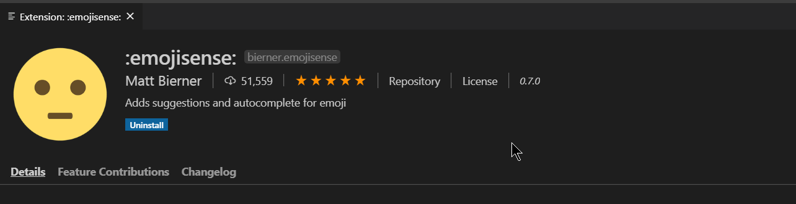
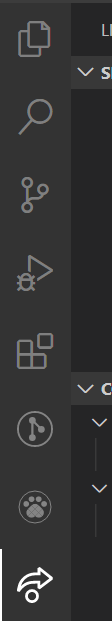

Graphql Code iterpreter :  https://marketplace.visualstudio.com/items?itemName=Prisma.vscode-graphql



**Better Comments - Aaron Bond**

**Bracket Pair Colonizer - CoenraadS**

**Code Time - Software**

**Color Highligh - Sergii Naumov**

**Error Lens - Alexander**

**Git History - Don Jayamanne**

**GitLens -- Git supercharge - Eric Amodio**

**Image preview - Kiss Tamas**

**Live Sass Compiler - Ritwick Dey**

**Live Server - Ritwick Dey**

**Paste JSON as Code - quicktype**

**Prettier - Code formatter - Esben Petersen**

**REST Client  - Huachao Mao**

**Stackoverflow Instant Search - Alexey-Strakh**

**Tokyo Night - enia - theme..**

**vscode-faker - Budi Irawan**


***

***

***

## Reverse a git commit very easily: Amazing undo last commit with vscode.

***

## Live Share in Vscdoe:

By: Microsoft. Helps you write code with friends like google docs way of writing code. Download this amazing extension. You need to connect a github account or github account for collaborating lively to be possible.


and it will appear as :   


***

RGB:

```js
'#00f' >> blue
'#0f0' >> green
'#f00' >> red
```

***

## Stackoverflow Instant Search (vscode extension)

Select some text in the code and press.., Ctrl +h to edit something with the query, but press Ctrl + Shift + h to directly query, it will show you all the related queries directly there, in vscode.

***

## Use faker: (vscode extension)

Ctrl + shift + p and typefaker and appropriate filed to use in code.

***